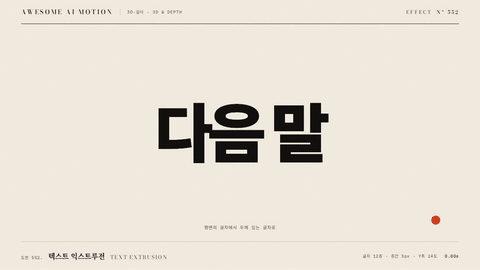

# Nº 552 텍스트 익스트루전 · Text Extrusion



[MP4](clip.mp4) · [HTML](index.html)

**같은 글자를 겹쳐 깊이 방향으로 벌리고 살짝 돌려 두꺼운 옆면이 보이게 하는 움직임**

The same letters are stacked, their back layers spread along depth and the group turns slightly to reveal a thick side.

| Family | Level | Purpose | Media | Runtime |
|---|---|---|---|---|
| 3D·깊이 · 3D & DEPTH | 중급 | 강조, 브랜딩 | 설명 영상, 숏폼, 발표 | css |

다른 이름 / Also known as: Text extrusion layers, 글자 깊이 적층, 겹층 입체 글자, 3d-text-depth-layers, 3D Text Extrusion, 텍스트 돌출 회전, Stacked Text Extrusion, 겹친 글자 돌출

## 선택 기준 / Selection

큰 제목에 질량과 물리적 존재감을 준다. 평면 글자가 부피 있는 물체로 바뀌는 순간이 눈에 띈다 / Adds mass and physical presence to a large headline. A flat word becomes a solid object.

- 오프닝 타이틀이나 챕터 제목에 무게를 줄 때 / Give weight to an opening title or chapter heading.
- 브랜드 워드마크를 입체로 소개할 때 / Introduce a brand wordmark in 3D.
- 한 단어를 결정적 키워드로 강조할 때 / Make one word the decisive keyword.

좋은 예 / Good: 제목이 1.2초 동안 8개 층으로 벌어지며 rotateY 18도로 기울어 옆면이 보이고, 마지막 프레임에서 앞면 글자는 또렷하게 남는다
나쁜 예 / Bad: 층 수가 적어 옆면이 띠처럼 끊겨 보이거나, 회전이 40도 이상이라 앞면 글자를 읽을 수 없다
주의 / Avoid: 층간 간격 3px 초과 시 층이 분리돼 보인다 · 본문 크기 글자에는 쓰지 않는다 · 앞면 층의 색은 뒤 층보다 밝게 한다

## 파라미터 / Parameters

| Parameter | Default | Range | Note |
|---|---|---|---|
| 층 수 | 8 | 6~14 | 많을수록 옆면이 매끈 |
| 층간 간격 | 2px | 1~3px | translateZ 기준 |
| 회전 | rotateY 18deg | 10~28deg | 앞면 가독성 우선 |
| 전개 시간 | 1.2s | 0.8~1.6s | 층 벌림과 회전 동시 |
| 이징 | power3.out | power2~expo.out |  |

## 구현 / Implementation (GSAP)

```js
const N = 8; // .layer 8개, 뒤층일수록 어둡게
gsap.set('.title', { transformPerspective: 900, transformStyle: 'preserve-3d' });
document.querySelectorAll('.layer').forEach((l, i) => {
  tl.fromTo(l, { z: 0 }, { z: -i * 2, duration: 1.2, ease: 'power3.out' }, 0.3);
});
tl.to('.title', { rotationY: 18, duration: 1.2, ease: 'power3.out' }, 0.3);
```

## 프롬프트 / Prompts

### 한국어 · Claude Code
```text
GSAP으로 <대상> 제목을 입체로 만들어 줘. 같은 글자를 8층 복제해 뒤로 갈수록 어둡게 하고, 0.3초부터 1.2초 동안 층 z를 -2px씩 벌리면서 그룹을 rotationY 18도로 돌려. 부모 perspective 900px, transform-style preserve-3d, 이징 power3.out. 앞면 글자는 최상단 층으로 남기고 도착 후 0.8초 정지해.
```

### 한국어 · Codex
```text
<파일>의 제목에 text-extrusion을 적용해. .layer 8개를 만들어 z=-i*2, 색 밝기를 i에 따라 낮추고, 그룹 rotationY 18을 0.3초부터 1.2초 동안 power3.out으로 건다. 0.3초, 0.9초, 2.0초를 캡처해 층이 벌어지는지, 2.0초에 옆면이 끊김 없이 이어지고 앞면 글자가 읽히는지 확인해.
```

### English · Claude Code
```text
Use GSAP to extrude the <target> headline. Clone the text into 8 layers, darker toward the back. Starting at 0.3 seconds, spread each layer -2px in z over 1.2 seconds while rotating the group rotationY 18 degrees. Parent perspective 900px, preserve-3d, ease power3.out. Keep the top layer as the readable front and hold 0.8 seconds.
```

### English · Codex
```text
Apply text-extrusion to the headline in <file>. Build 8 .layer copies with z=-i*2 and decreasing brightness, and tween the group rotationY 18 from 0.3s for 1.2s with power3.out. Capture at 0.3, 0.9 and 2.0 seconds: layers opening up, then a continuous side face at 2.0 with the front text still legible.
```

예시 / Example: 텍스트 익스트루전를 `.hero`에 적용해. / Apply Text Extrusion to `.hero`.

## 적용 / Application

- HyperFrames: 층 복제는 로드 시 정적으로 생성하고 z와 rotationY만 paused 타임라인에서 움직인다. seek 후 층 수가 변하지 않는지 확인한다
- ReelForge: 제목 텍스트, 층 수 8, 색 2개를 브리프에 싣고 층 복제는 워커가 마크업으로 만든다
- Scrolline Deck: 진행률 0~1을 z 간격 0~2px와 회전 0~18도에 함께 매핑한다. ease-out을 쓰고 스프링은 피한다

조합 / Pair with: [3D 원근 틸트 리빌 · Perspective Tilt Reveal](../perspective-tilt/) · [3D 조립 · Depth Assemble](../depth-assemble/) · [키네틱 비트 · Kinetic Beats](../kinetic-beats/)

출처 / Sources: [heygen-com/hyperframes](https://raw.githubusercontent.com/heygen-com/hyperframes/main/registry/blocks/code-3d-extrude/registry-item.json) (Apache-2.0) · local/hyperframes-animation (`claude-skill:hyperframes-animation/rules/3d-text-depth-layers.md`) (unknown) · [helpx.adobe.com](https://helpx.adobe.com/after-effects/desktop/work-with-layers/3d-layers/3d-layers.html) (unknown) · [heygen-com/hyperframes](https://github.com/heygen-com/hyperframes/blob/HEAD/skills/hyperframes-animation/rules/3d-text-depth-layers.md) (Apache-2.0) · [mrdoob/three.js](https://threejs.org/examples/#webgl_geometry_text) (MIT) · [DavidHDev/react-bits](https://github.com/DavidHDev/react-bits) (MIT + Commons Clause v1.0) · [uuuulala/WebGL-typing-tutorial](https://github.com/uuuulala/WebGL-typing-tutorial) (MIT) · [ehaakana/codrops-text-demo](https://github.com/ehaakana/codrops-text-demo) (MIT)

[목록 / Catalog](../../references/catalog.md) · [index.json](../../index.json)
