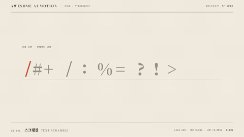

# Nº 092 스크램블 · Text Scramble



[MP4](clip.mp4) · [HTML](index.html)

**자리마다 기호가 바뀌다가 왼쪽부터 정답 글자로 고정되는 효과**

Symbols cycle in each character position before resolving into the final text from left to right.

| Family | Level | Purpose | Media | Runtime |
|---|---|---|---|---|
| 타이포 · TYPOGRAPHY | 기본 | 주목 끌기, 분위기 | 설명 영상, 숏폼, 웹 UI | gsap |

다른 이름 / Also known as: 텍스트 해독, 문자 셔플, 글자 해독, Matrix decode, Binary decrypt, 문자 디코드, hacker-flip-3d

## 선택 기준 / Selection

불확실한 문자 배열이 읽을 수 있는 문장으로 수렴하는 과정 / Shows an uncertain sequence of characters converging into a readable sentence.

- 짧은 제목에 해독되는 느낌을 줄 때 / Give a short title a decoding effect.
- 정답이나 결과가 점차 확정되는 과정을 연출할 때 / Reveal an answer or result as it becomes progressively resolved.

좋은 예 / Good: 고정 폭 자리의 기호가 0.05초마다 바뀌고 왼쪽 글자부터 원문으로 고정된다
나쁜 예 / Bad: 매 프레임 새 난수를 생성해 seek할 때 같은 시점의 기호가 달라진다
주의 / Avoid: 난수를 업데이트 함수 안에서 생성하지 않는다 · 기호 폭 차이로 문장의 자리 위치가 흔들리지 않게 한다

## 파라미터 / Parameters

| Parameter | Default | Range | Note |
|---|---|---|---|
| 기호 갱신 간격 | 0.05s | 0.04~0.10s | 미리 생성한 표의 행을 선택한다 |
| 글자 고정 간격 | 0.085s | 0.06~0.12s | 공백 자리는 보존한다 |
| 첫 글자 고정 | 0.70s | 0.50~0.90s | 기호 순환을 먼저 보여준다 |
| 난수 시드 | 603 | 1~9999 | 동일 시점은 동일한 기호를 보여준다 |

이징 / Ease: `none`

## 구현 / Implementation (GSAP)

```js
const random = Motion.rand(603);
const table = Array.from({length:61}, () => text.map(c => c === ' ' ? ' ' : symbols[Math.floor(random()*symbols.length)]));
const state = {time:0};
tl.to(state, {time:3, duration:3, ease:'none', onUpdate:paint}, 0);
// paint는 표를 선택하고 왼쪽부터 정답으로 치환한다.
const tick = Math.min(60, Math.max(0, Math.floor((state.time-.3)/.05)));
chars.forEach((c,i) => c.textContent = state.time >= .7+i*.085 ? text[i] : table[tick][i]);
```

## 프롬프트 / Prompts

### 한국어 · Claude Code
```text
<대상>에 이 효과를 적용하라. AI는 다음 말을 고른다의 글자 자리를 원문 폭으로 고정하고 공백을 보존하라. Motion.rand(603)으로 기호 표를 미리 생성해 0.30초부터 0.05초 간격으로 바꾸고 0.70초부터 왼쪽 글자를 0.085초 간격으로 정답에 고정하라. 3초 타임라인 안에서 마지막 0.6초는 완성 상태로 정지하라.
```

### 한국어 · Codex
```text
<파일>의 텍스트 장면에 적용하라. AI는 다음 말을 고른다의 글자 자리를 원문 폭으로 고정하고 공백을 보존하라. Motion.rand(603)으로 기호 표를 미리 생성해 0.30초부터 0.05초 간격으로 바꾸고 0.70초부터 왼쪽 글자를 0.085초 간격으로 정답에 고정하라. 0.43초에 기호가 보이는지, 1.23초에 왼쪽은 정답이고 오른쪽은 기호인지, 2.7초에 완성 문장인지 확인하라. 1.23초를 앞뒤로 반복 seek해 기호가 동일한지도 확인하라.
```

### English · Claude Code
```text
Apply this effect to <target>. Fix each character slot in "AI picks the next word" to its original text width and preserve spaces. Precompute a symbol table with Motion.rand(603), cycle symbols at 0.05-second intervals starting at 0.30 seconds, and lock characters to the final text from left to right at 0.085-second intervals starting at 0.70 seconds. Within a 3-second timeline, hold the completed state for the final 0.6 seconds.
```

### English · Codex
```text
Apply this to the text scene in <file>. Fix each character slot in "AI picks the next word" to its original text width and preserve spaces. Precompute a symbol table with Motion.rand(603), cycle symbols at 0.05-second intervals starting at 0.30 seconds, and lock characters to the final text from left to right at 0.085-second intervals starting at 0.70 seconds. Verify symbols at 0.43 seconds, resolved text on the left and symbols on the right at 1.23 seconds, and the completed sentence at 2.7 seconds. Repeatedly seek forward and backward to 1.23 seconds to verify identical symbols.
```

예시 / Example: 스크램블를 `.hero`에 적용해. / Apply Text Scramble to `.hero`.

## 적용 / Application

- HyperFrames: 단일 paused GSAP 타임라인으로 구현하고 프레임 시각에서 seek한다. 폰트 로딩 후 고정한 글자 배치를 사용한다.
- ReelForge: 텍스트 씬 안의 span에 이 효과의 시간과 간격을 적용하고 마지막 완성 상태를 0.6초 이상 유지한다.
- Scrolline Deck: 스크롤 진행률을 0~3초 타임라인 시각으로 매핑하고 역방향 seek에서도 같은 문자와 상태를 복원한다.

조합 / Pair with: [타자기 · Typewriter](../typewriter/) · [다음 말 고르기 · Next-token Pick](../next-token/) · [토큰 쪼개기 · Token Split](../token-split/)

출처 / Sources: [GSAP Timeline 공식 문서](https://gsap.com/docs/v3/GSAP/Timeline/) (공식 문서 개념 참조) · [heygen-com/hyperframes](https://raw.githubusercontent.com/heygen-com/hyperframes/main/registry/components/matrix-decode/registry-item.json) (Apache-2.0) · [heygen-com/hyperframes](https://raw.githubusercontent.com/heygen-com/hyperframes/main/registry/components/scramble-reveal/registry-item.json) (Apache-2.0) · [heygen-com/hyperframes](https://raw.githubusercontent.com/heygen-com/hyperframes/main/registry/components/caption-matrix-decode/registry-item.json) (Apache-2.0)

[목록 / Catalog](../../references/catalog.md) · [index.json](../../index.json)
