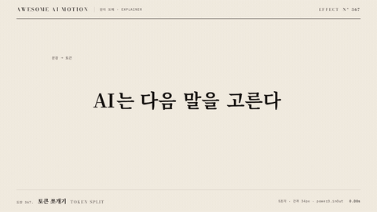

# Nº 367 토큰 쪼개기 · Token Split



[MP4](clip.mp4) · [HTML](index.html)

**붙어 있던 문장을 간격 있는 토큰 조각으로 나누는 움직임**

An animation that separates a continuous sentence into spaced token fragments.

| Family | Level | Purpose | Media | Runtime |
|---|---|---|---|---|
| 원리 도해 · EXPLAINER | 기본 | 설명, 순서·흐름 | 설명 영상, 발표, 스크롤덱 | gsap |

다른 이름 / Also known as: 토큰 분리, Tokenization, Tokenization split

## 선택 기준 / Selection

문장이 모델이 읽는 작은 단위로 바뀐다 / Shows how a sentence becomes the smaller units a model reads.

- 토큰화 과정을 소개할 때 / When introducing tokenization
- 입력 문장의 처리 단위를 보여줄 때 / When showing the processing units of an input sentence

좋은 예 / Good: AI는 다음 말을 고른다가 5조각으로 벌어지고 번호가 붙는다
나쁜 예 / Bad: 글자를 무작위로 흩어 토큰 순서를 잃는다
주의 / Avoid: 실제 토크나이저의 결과라고 단정하지 않는다 · 조각 사이를 과도하게 벌리지 않는다

## 파라미터 / Parameters

| Parameter | Default | Range | Note |
|---|---|---|---|
| 조각 수 | 5 | 3~8 | 교육용 예시 분할 |
| 추가 간격 | 34px | 24~44px | 중앙 기준 양쪽 이동 |
| 분리 지속 | 1.05s | 0.8~1.3s | 변화를 읽을 시간 |
| 번호 시간차 | 0.06s | 0.04~0.1s | 순서 유지 |

이징 / Ease: `power3.inOut`

## 구현 / Implementation (GSAP)

```js
const tl = Motion.timeline();
const pieces = document.querySelectorAll('.token');
pieces.forEach((el,i)=>tl.to(el,{x:(i-2)*34,duration:1.05,ease:'power3.inOut'},.3));
tl.to(pieces[2],{color:'var(--verm)',duration:.35},.75);
tl.to('.under',{opacity:1,duration:.35,stagger:.06},1.1);
```

## 프롬프트 / Prompts

### 한국어 · Claude Code
```text
<대상> 문장을 5개의 span으로 분리해 0.3초부터 중앙 기준 (i-2)×34px 이동시킨다. 이동은 1.05초 power3.inOut으로 하고 세 번째 조각만 주홍으로 만든다. 1.1초부터 조각 아래 헤어라인과 번호를 0.06초 간격으로 공개한다. 3초 타임라인 하나로 만들고 마지막 0.6초는 정지한다.
```

### 한국어 · Codex
```text
<파일>의 <대상>에 <대상> 문장을 5개의 span으로 분리해 0.3초부터 중앙 기준 (i-2)×34px 이동시킨다. 이동은 1.05초 power3.inOut으로 하고 세 번째 조각만 주홍으로 만든다. 1.1초부터 조각 아래 헤어라인과 번호를 0.06초 간격으로 공개한다. 0.24초, 1.25초, 2.9초를 캡처해 순서 유지, 간격 증가, 번호와 마지막 홀드를 확인한다. 시간은 GSAP 타임라인만 사용한다.
```

### English · Claude Code
```text
Split the <target> sentence into 5 spans and move them relative to the center by (i-2)×34px starting at 0.3 seconds. Use a movement duration of 1.05 seconds with power3.inOut, and make only the third fragment vermilion. Starting at 1.1 seconds, reveal hairlines and numbers below the fragments at 0.06-second intervals. Use a single 3-second timeline and hold still for the final 0.6 seconds.
```

### English · Codex
```text
In <target> in <file>, Split the <target> sentence into 5 spans and move them relative to the center by (i-2)×34px starting at 0.3 seconds. Use a movement duration of 1.05 seconds with power3.inOut, and make only the third fragment vermilion. Starting at 1.1 seconds, reveal hairlines and numbers below the fragments at 0.06-second intervals. Capture at 0.24, 1.25, and 2.9 seconds to check preserved order, increased spacing, numbering, and the final hold. Use only a GSAP timeline for timing.
```

예시 / Example: 토큰 쪼개기를 `.hero`에 적용해. / Apply Token Split to `.hero`.

## 적용 / Application

- HyperFrames: 3초 paused GSAP 타임라인 하나로 구성하고 Motion.ready()로 seek를 노출한다. 조각마다 중앙 기준 x 오프셋을 주고 번호 opacity를 순차적으로 올린다.
- ReelForge: 3초 장면 안의 요소를 분리하고 transform과 opacity 트랙으로 같은 순서를 구현한다. 조각마다 중앙 기준 x 오프셋을 주고 번호 opacity를 순차적으로 올린다.
- Scrolline Deck: 0.3~2.4초 동작을 스크롤 진행률 10~80%로 매핑하고 끝 20%를 완성 상태로 둔다. 조각마다 중앙 기준 x 오프셋을 주고 번호 opacity를 순차적으로 올린다.

조합 / Pair with: [글자별 스태거 · Per-character Rise](../char-stagger/) · [어텐션 선 · Attention Lines](../attention-lines/) · [다음 말 고르기 · Next-token Pick](../next-token/)

출처 / Sources: [Hugging Face Tokenizers 공식 문서](https://huggingface.co/docs/tokenizers/index) (개념 참고) · motion dictionary 3-type-data-ui.md#28. 토큰 쪼개기 · Tokenization split (own)

[목록 / Catalog](../../references/catalog.md) · [index.json](../../index.json)
