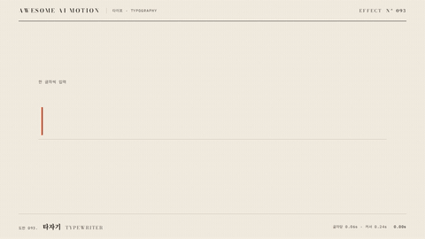

# Nº 093 타자기 · Typewriter



[MP4](clip.mp4) · [HTML](index.html)

**문장을 한 글자씩 일정 간격으로 드러내고 커서가 입력 위치를 따라가는 효과**

A sentence appears one character at a time at regular intervals while a cursor follows the insertion point.

| Family | Level | Purpose | Media | Runtime |
|---|---|---|---|---|
| 타이포 · TYPOGRAPHY | 기본 | 순서·흐름, 피드백 | 설명 영상, 숏폼, 웹 UI | gsap |

다른 이름 / Also known as: 타이핑 효과, Type-on, 타자기 리빌, typewriter-vs-fade-sequence, discrete-text-sequence, gsap-effects, typewriter-reveal, 타자기 텍스트

## 선택 기준 / Selection

글이 작성되는 과정과 순차적 입력 / Communicates the process of writing and sequential text input.

- 짧은 입력 문장이 만들어지는 과정을 보여줄 때 / Show a short input sentence being composed.
- 대화형 UI에서 작성 중이라는 상태를 보여줄 때 / Show a typing state in a conversational UI.

좋은 예 / Good: AI는 다음 말을 고른다가 0.06초 간격으로 완성되고 커서가 마지막 글자 뒤에 멈춘다
나쁜 예 / Bad: 긴 본문 전체를 느리게 입력해 내용을 읽기까지 기다리게 한다
주의 / Avoid: 긴 본문에는 적용하지 않는다 · 커서 점멸을 완성 홀드까지 계속하지 않는다

## 파라미터 / Parameters

| Parameter | Default | Range | Note |
|---|---|---|---|
| 글자 간격 | 0.06s | 0.04~0.10s | 공백도 한 자리로 센다 |
| 시작 시각 | 0.30s | 0.20~0.40s | 시작 상태를 먼저 보여준다 |
| 커서 점멸 간격 | 0.24s | 0.20~0.40s | 2.4초 이후 켜진 채 정지한다 |

이징 / Ease: `none`

## 구현 / Implementation (GSAP)

```js
const state = {time:0};
tl.to(state, {time:3, duration:3, ease:'none', onUpdate:paint}, 0);
// paint에서 글자 수와 커서 위치를 매번 재계산한다.
const n = Math.min(chars.length, Math.max(0, Math.floor((state.time-.3+1e-7)/.06)+1));
chars.forEach((c,i) => c.style.opacity = i < n ? 1 : 0);
gsap.set('#caret', {x:-widths.slice(n).reduce((w,v)=>w+v,0)});
```

## 프롬프트 / Prompts

### 한국어 · Claude Code
```text
<대상>에 이 효과를 적용하라. AI는 다음 말을 고른다를 글자 span으로 나누고 0.30초부터 0.06초 간격으로 즉시 드러내라. 주홍 커서는 입력 끝을 따라가며 0.24초 간격으로 점멸하고 2.4초부터 켜진 채 유지하라. 3초 타임라인 안에서 마지막 0.6초는 완성 상태로 정지하라.
```

### 한국어 · Codex
```text
<파일>의 텍스트 장면에 적용하라. AI는 다음 말을 고른다를 글자 span으로 나누고 0.30초부터 0.06초 간격으로 즉시 드러내라. 주홍 커서는 입력 끝을 따라가며 0.24초 간격으로 점멸하고 2.4초부터 켜진 채 유지하라. 0.23초에 입력 전 커서, 0.75초에 부분 입력, 2.7초에 완성 문장과 고정 커서를 확인하라.
```

### English · Claude Code
```text
Apply this effect to <target>. Split "AI picks the next word" into character spans and reveal each instantly at 0.06-second intervals starting at 0.30 seconds. Make a vermilion cursor follow the end of the input and blink at 0.24-second intervals, then remain on from 2.4 seconds. Within a 3-second timeline, hold the completed state for the final 0.6 seconds.
```

### English · Codex
```text
Apply this to the text scene in <file>. Split "AI picks the next word" into character spans and reveal each instantly at 0.06-second intervals starting at 0.30 seconds. Make a vermilion cursor follow the end of the input and blink at 0.24-second intervals, then remain on from 2.4 seconds. Check the cursor before typing at 0.23 seconds, partial input at 0.75 seconds, and the completed sentence with a steady cursor at 2.7 seconds.
```

예시 / Example: 타자기를 `.hero`에 적용해. / Apply Typewriter to `.hero`.

## 적용 / Application

- HyperFrames: 단일 paused GSAP 타임라인으로 구현하고 프레임 시각에서 seek한다. 폰트 로딩 후 고정한 글자 배치를 사용한다.
- ReelForge: 텍스트 씬 안의 span에 이 효과의 시간과 간격을 적용하고 마지막 완성 상태를 0.6초 이상 유지한다.
- Scrolline Deck: 스크롤 진행률을 0~3초 타임라인 시각으로 매핑하고 역방향 seek에서도 같은 문자와 상태를 복원한다.

조합 / Pair with: [타이핑 입력 · Typing Input](../typing-input/) · [답 스트리밍 · Answer Streaming](../answer-stream/) · [글자별 스태거 · Per-character Rise](../char-stagger/)

출처 / Sources: [GSAP Timeline 공식 문서](https://gsap.com/docs/v3/GSAP/Timeline/) (공식 문서 개념 참조) · [heygen-com/hyperframes](https://raw.githubusercontent.com/heygen-com/hyperframes/main/registry/components/typewriter/registry-item.json) (Apache-2.0) · [heygen-com/hyperframes](https://raw.githubusercontent.com/heygen-com/hyperframes/main/registry/components/typed-prompt/registry-item.json) (Apache-2.0) · [heygen-com/hyperframes](https://raw.githubusercontent.com/heygen-com/hyperframes/main/registry/blocks/code-typing/registry-item.json) (Apache-2.0) · [heygen-com/hyperframes](https://raw.githubusercontent.com/heygen-com/hyperframes/main/registry/components/notes-typing/registry-item.json) (Apache-2.0) · [heygen-com/hyperframes](https://raw.githubusercontent.com/heygen-com/hyperframes/main/registry/blocks/notes-reveal/registry-item.json) (Apache-2.0)

[목록 / Catalog](../../references/catalog.md) · [index.json](../../index.json)
