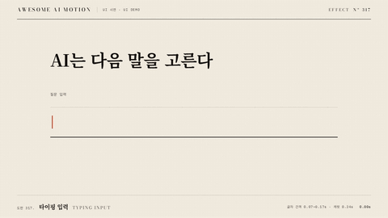

# Nº 317 타이핑 입력 · Typing Input



[MP4](clip.mp4) · [HTML](index.html)

**질문이 글자마다 불규칙한 간격으로 입력되고 끝의 캐럿이 깜빡이는 동작**

An animation in which a question is typed character by character at irregular intervals with a blinking caret at the end.

| Family | Level | Purpose | Media | Runtime |
|---|---|---|---|---|
| UI 시연 · UI DEMO | 기본 | 설명, 피드백 | 제품 시연, 설명 영상, 웹 UI | gsap |

다른 이름 / Also known as: 입력 시뮬레이션, 입력 시연, 입력창 타이핑, Keyboard Press Demo, 키보드 입력 시연, Typing input simulation, Backspace retype

## 선택 기준 / Selection

사람이 질문을 입력하는 속도와 입력 위치 / Shows the pace of a person typing a question and the current insertion point.

- 다음 말은 어떻게 고르나요?가 0.38~1.91초에 입력되고 캐럿이 끝으로 따라간다 / When typing "How do you pick the next word?" from 0.38 to 1.91 seconds with a caret following the end
- 사람이 질문을 입력하는 속도와 입력 위치을 보여 줄 때 / When showing the pace of a person typing a question and the insertion point

좋은 예 / Good: 다음 말은 어떻게 고르나요?가 0.38~1.91초에 입력되고 캐럿이 끝으로 따라간다
나쁜 예 / Bad: 모든 글자가 같은 간격으로 나와 기계적인 입력처럼 보인다
주의 / Avoid: 모든 글자가 같은 간격으로 나와 기계적인 입력처럼 보인다 · 동작 종료 뒤 최소 0.5초 읽기 시간을 둔다

## 파라미터 / Parameters

| Parameter | Default | Range | Note |
|---|---|---|---|
| 입력 시작 | 0.38s | 0.3~0.5s | 첫 글자 노출 시각 |
| 글자 간격 | 0.07~0.17s | 0.05~0.2s | 고정 배열로 불규칙성을 재현 |
| 캐럿 반주기 | 0.24s | 0.2~0.4s | 타임라인 set으로 깜빡임 |
| 입력 완료 | 1.91s | 1.7~2.3s | 마지막 0.6초는 정지 |

이징 / Ease: `none`

## 구현 / Implementation (GSAP)

```js
const tl = Motion.timeline();
const chars=Array.from('다음 말은 어떻게 고르나요?');
document.querySelector('#text').innerHTML=chars.map(c=>`<span class="char">${c===' '?'&nbsp;':c}</span>`).join('');
const gaps=[.08,.11,.07,.14,.09,.12,.17,.08,.1,.07,.15,.09,.11,.13,.1,.08];
let at=.3;
document.querySelectorAll('.char').forEach((el,i)=>{at+=gaps[i];tl.set(el,{display:'inline'},at);});
[.24,.48,.72,.96,1.2,1.44,1.68,1.92,2.16,2.4].forEach((t,i)=>tl.set('.caret',{opacity:i%2?1:0},t));
tl.set('.caret',{opacity:1},2.4);
tl.to('.lead',{opacity:1,duration:.2},2.2);
```

## 프롬프트 / Prompts

### 한국어 · Claude Code
```text
<대상> 입력창에 다음 말은 어떻게 고르나요?를 0.3초 뒤부터 글자 span으로 표시해줘. 간격은 [0.08,0.11,0.07,0.14,0.09,0.12,0.17,0.08,0.10,0.07,0.15,0.09,0.11,0.13,0.10]초로 고정하고 캐럿은 0.24초마다 깜빡여. 2.4초부터 캐럿을 켜고 3초까지 완성 문장을 유지해.
```

### 한국어 · Codex
```text
<파일>의 채팅 입력 장면에서 질문 문자열을 글자 span으로 쪼개고 GSAP set으로 표시해. 0.3초를 기준으로 고정 간격 배열 0.07~0.17초를 누적해 1.91초에 입력을 마치고 캐럿은 0.24초마다 opacity를 바꿔. 0.23초, 0.73초, 1.73초, 2.9초 캡처에서 빈 입력창, 부분 입력, 마지막 입력, 완성 홀드를 확인해.
```

### English · Claude Code
```text
Reveal "How do you pick the next word?" in the <target> input field using character spans starting after 0.3 seconds. Fix the intervals at [0.08,0.11,0.07,0.14,0.09,0.12,0.17,0.08,0.10,0.07,0.15,0.09,0.11,0.13,0.10] seconds and blink the caret every 0.24 seconds. From 2.4 seconds, keep the caret visible and hold the completed sentence until 3 seconds.
```

### English · Codex
```text
In the chat input scene in <file>, split the question string into character spans and reveal them using GSAP set. Starting from 0.3 seconds, accumulate the fixed interval array of 0.07 to 0.17 seconds to finish typing at 1.91 seconds, and toggle the caret opacity every 0.24 seconds. Capture at 0.23, 0.73, 1.73, and 2.9 seconds to check the empty field, partial input, final typing, and completed hold.
```

예시 / Example: 타이핑 입력를 `.hero`에 적용해. / Apply Typing Input to `.hero`.

## 적용 / Application

- HyperFrames: 공용 하네스의 paused 타임라인에 모든 동작을 넣어 초 단위 seek로 검증한다
- ReelForge: UI 요소와 강조 요소를 분리하고 동일한 타이밍 수치를 씬 파라미터로 옮긴다
- Scrolline Deck: 3초 타임라인을 스크롤 진행률 0~1로 매핑하고 마지막 0.5초에 완성 상태를 유지한다

조합 / Pair with: [타자기 · Typewriter](../typewriter/) · [커서 이동과 클릭 · Cursor Move & Click](../cursor-click/) · [답 스트리밍 · Answer Streaming](../answer-stream/)

출처 / Sources: [GSAP Timeline 공식 문서](https://gsap.com/docs/v3/GSAP/Timeline/) (공식 문서 개념 참조) · [heygen-com/hyperframes](https://raw.githubusercontent.com/heygen-com/hyperframes/main/registry/components/signup-flow/registry-item.json) (Apache-2.0) · [heygen-com/hyperframes](https://raw.githubusercontent.com/heygen-com/hyperframes/main/registry/components/input-feedback/registry-item.json) (Apache-2.0) · [ui.aceternity.com](https://ui.aceternity.com/components/keyboard) (unknown) · [magicuidesign/magicui](https://magicui.design/docs/components/terminal) (MIT) · [mattboldt/typed.js](https://github.com/mattboldt/typed.js) (GPL-3.0-or-later)

[목록 / Catalog](../../references/catalog.md) · [index.json](../../index.json)
