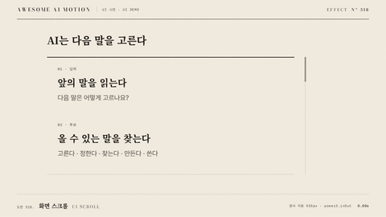

# Nº 318 화면 스크롤 · UI Scroll



[MP4](clip.mp4) · [HTML](index.html)

**긴 문서 내용을 부드럽게 위로 옮겨 목표 문단에 멈추고 세로선으로 표시하는 동작**

An animation that smoothly moves a long document upward, stops at a target paragraph, and marks it with a vertical line.

| Family | Level | Purpose | Media | Runtime |
|---|---|---|---|---|
| UI 시연 · UI DEMO | 기본 | 설명, 강조 | 제품 시연, 설명 영상, 웹 UI | gsap |

다른 이름 / Also known as: 문서 스크롤, Tilted page scroll, 기울어진 페이지 스크롤, UI 콘텐츠 스크롤, 3d-page-scroll, Horizontal scroll gallery

## 선택 기준 / Selection

문서 안의 이동 방향과 도착한 읽기 위치 / Shows the direction of travel within a document and the reading position reached.

- 문서를 555px 스크롤한 뒤 다음 말 하나를 고른다 문단 왼쪽에 주홍 선을 세운다 / When scrolling a document by 555px and placing a vermilion line to the left of the "Pick one next word" paragraph
- 문서 안의 이동 방향과 도착한 읽기 위치을 보여 줄 때 / When showing document navigation direction and the reading position reached

좋은 예 / Good: 문서를 555px 스크롤한 뒤 다음 말 하나를 고른다 문단 왼쪽에 주홍 선을 세운다
나쁜 예 / Bad: 목표 문단이 잘린 채 멈추거나 스크롤 도중 강조선이 엉뚱한 문단에 붙는다
주의 / Avoid: 목표 문단이 잘린 채 멈추거나 스크롤 도중 강조선이 엉뚱한 문단에 붙는다 · 동작 종료 뒤 최소 0.5초 읽기 시간을 둔다

## 파라미터 / Parameters

| Parameter | Default | Range | Note |
|---|---|---|---|
| 문서 이동 | 555px | 300~800px | 목표 문단 상단이 창 안쪽 30px에 정렬 |
| 스크롤 지속 | 1.55s | 1.0~1.9s | 출발과 정지가 읽히도록 |
| 표시 지연 | 정지 후 0.05s | 0~0.2s | 도착 뒤 주홍 선 노출 |
| 세로선 | 4×125px / 0.30s | 3~6px / 0.2~0.4s | scaleY로 선을 세운다 |

이징 / Ease: `power3.inOut`

## 구현 / Implementation (GSAP)

```js
const tl = Motion.timeline();
tl.to('.doc',{y:-555,duration:1.55,ease:'power3.inOut'},.3);
tl.to('.thumb',{y:250,duration:1.55,ease:'power3.inOut'},.3);
tl.fromTo('.mark',{scaleY:0,opacity:0},{scaleY:1,opacity:1,duration:.3,ease:'power2.out'},1.9);
tl.to('.lead',{opacity:1,duration:.2},2.2);
```

## 프롬프트 / Prompts

### 한국어 · Claude Code
```text
<대상> 문서 창은 820×390px로 두고 내부 문서를 0.3초부터 1.55초 동안 y -555px로 power3.inOut 스크롤해줘. 목표 문단이 창 안쪽 30px에 정렬되면 1.9초부터 주홍 4×125px 세로선을 0.3초 동안 scaleY 0에서 1로 표시해. 2.4~3초는 완성 상태로 유지해.
```

### 한국어 · Codex
```text
<파일>의 문서 시연에 overflow hidden 창과 내부 문서 transform 스크롤을 적용해. 0.3~1.85초에 y -555px, power3.inOut으로 옮기고 스크롤바 thumb은 y 250px로 같이 이동해. 0.23초, 1.23초, 2.9초 캡처로 이동, 목표 문단 전체 노출, 왼쪽 주홍 세로선과 완성 홀드를 확인해.
```

### English · Claude Code
```text
Set the <target> document viewport to 820×390px and scroll the inner document to y -555px over 1.55 seconds starting at 0.3 seconds with power3.inOut. Once the target paragraph is aligned 30px inside the viewport, reveal a vermilion 4×125px vertical line by changing scaleY from 0 to 1 over 0.3 seconds starting at 1.9 seconds. Hold the completed state from 2.4 to 3 seconds.
```

### English · Codex
```text
Apply an overflow hidden viewport and transform-based scrolling of the inner document to the document demonstration in <file>. Move to y -555px from 0.3 to 1.85 seconds with power3.inOut, and move the scrollbar thumb to y 250px in sync. Capture at 0.23, 1.23, and 2.9 seconds to check the motion, full visibility of the target paragraph, the vermilion vertical line on the left, and the final hold.
```

예시 / Example: 화면 스크롤를 `.hero`에 적용해. / Apply UI Scroll to `.hero`.

## 적용 / Application

- HyperFrames: 공용 하네스의 paused 타임라인에 모든 동작을 넣어 초 단위 seek로 검증한다
- ReelForge: UI 요소와 강조 요소를 분리하고 동일한 타이밍 수치를 씬 파라미터로 옮긴다
- Scrolline Deck: 3초 타임라인을 스크롤 진행률 0~1로 매핑하고 마지막 0.5초에 완성 상태를 유지한다

조합 / Pair with: [이징 · Easing](../easing-curves/) · [스포트라이트 · Spotlight](../spotlight/) · [점진적 공개 · Progressive Disclosure](../progressive-disclosure/)

출처 / Sources: [GSAP Timeline 공식 문서](https://gsap.com/docs/v3/GSAP/Timeline/) (공식 문서 개념 참조) · [heygen-com/hyperframes](https://raw.githubusercontent.com/heygen-com/hyperframes/main/registry/components/scroll-camera-story/registry-item.json) (Apache-2.0) · [heygen-com/hyperframes](https://github.com/heygen-com/hyperframes/blob/HEAD/skills/hyperframes-animation/rules/3d-page-scroll.md) (Apache-2.0) · [martinlaxenaire/curtainsjs](https://www.curtainsjs.com/examples/multiple-planes-scroll-effect/) (MIT) · [greensock/GSAP](https://gsap.com/docs/v3/Plugins/ScrollTrigger/) (GSAP Standard License) · [motion.dev examples](https://motion.dev/examples/react-scroll-horizontal) (unknown)

[목록 / Catalog](../../references/catalog.md) · [index.json](../../index.json)
