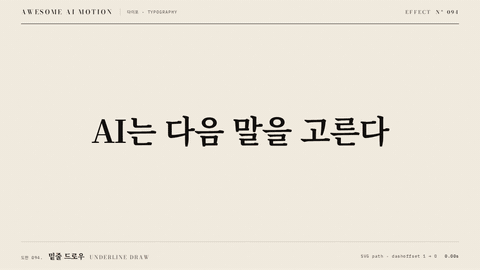

# Nº 094 밑줄 드로우 · Underline Draw



[MP4](clip.mp4) · [HTML](index.html)

**핵심어 아래의 SVG 경로를 왼쪽부터 한 획으로 그리는 효과**

An SVG path draws beneath a key phrase from left to right in a single stroke.

| Family | Level | Purpose | Media | Runtime |
|---|---|---|---|---|
| 타이포 · TYPOGRAPHY | 기본 | 강조, 설명 | 설명 영상, 발표, 스크롤덱 | svg |

다른 이름 / Also known as: 밑줄 그리기, Stroke reveal, Underline stroke draw, Animated Underline Draw, 텍스트 밑줄 그리기, 마커 밑줄 그리기, underline-emphasis-sweep

## 선택 기준 / Selection

읽어야 할 단어를 손으로 짚듯 강조한다 / Emphasizes the words to read as if pointing to them by hand.

- 핵심어를 한 번 짚을 때 / Call attention to a key phrase once.
- 문장에 필기하는 듯한 강조를 넣을 때 / Add a handwritten emphasis to a sentence.

좋은 예 / Good: 다음 말 아래의 조금 휜 주홍 선을 1.35초에 걸쳐 그린다
나쁜 예 / Bad: 밑줄 전체를 갑자기 켜서 그리는 방향이 보이지 않는다
주의 / Avoid: 글자 획에 밑줄을 겹치지 않는다 · dashoffset을 정수로 반올림하지 않는다

## 파라미터 / Parameters

| Parameter | Default | Range | Note |
|---|---|---|---|
| 지속 | 1.35s | 0.7~1.5s | 부분 획이 보이는 속도 |
| 선 두께 | 6px | 3~8px | 84px 제목 기준 |
| 정규화 길이 | 1 | 1 | pathLength와 dasharray를 1로 맞춘다 |
| 시작 | 0.3s | 0.2~0.5s | 단어를 먼저 읽는다 |

이징 / Ease: `none`

## 구현 / Implementation (GSAP)

```js
const tl = Motion.timeline();
tl.fromTo('.underline path', {strokeDashoffset:1}, {strokeDashoffset:0, autoRound:false, duration:1.35, ease:'none'}, 0.3);
tl.to('.lead', {opacity:1, duration:0.25}, 1.85);
Motion.ready();
```

## 프롬프트 / Prompts

### 한국어 · Claude Code
```text
<대상>의 다음 말 아래에 주홍 SVG 밑줄을 한 획으로 그려줘. pathLength 1, stroke-dasharray 1, 두께 6px, 둥근 끝과 약간 휜 경로를 사용해. 0.3초부터 strokeDashoffset 1에서 0으로 1.35초 동안 ease none, autoRound false로 움직이고 3초까지 완성 상태를 유지해.
```

### 한국어 · Codex
```text
<파일>의 핵심어 span 아래에 viewBox 0 0 270 32의 SVG 경로 M 5 20 C 72 11 172 13 264 17을 배치해. pathLength와 dasharray는 1이고 0.3초부터 dashoffset 1에서 0으로 duration 1.35초, ease none, autoRound false를 적용해. 0.23초, 0.73초, 1.23초, 2.9초 캡처로 선 없음, 부분 획, 길이 증가, 완성 홀드를 확인해.
```

### English · Claude Code
```text
Draw a vermilion SVG underline beneath "next word" in <target> in a single stroke. Use pathLength 1, stroke-dasharray 1, a 6px stroke, rounded caps, and a slightly curved path. Starting at 0.3 seconds, animate strokeDashoffset from 1 to 0 over 1.35 seconds with ease none and autoRound false. Hold the completed state until 3 seconds.
```

### English · Codex
```text
Place an SVG path with viewBox 0 0 270 32 and path M 5 20 C 72 11 172 13 264 17 beneath the key phrase span in <file>. Set pathLength and dasharray to 1. Starting at 0.3 seconds, animate dashoffset from 1 to 0 with duration 1.35 seconds, ease none, and autoRound false. Capture at 0.23, 0.73, 1.23, and 2.9 seconds to check no line, a partial stroke, increasing length, and the completed hold.
```

예시 / Example: 밑줄 드로우를 `.hero`에 적용해. / Apply Underline Draw to `.hero`.

## 적용 / Application

- HyperFrames: pathLength 1인 SVG 경로에 dasharray 1을 설정하고 autoRound false로 dashoffset을 연속 보간한다
- ReelForge: 핵심어 아래에 SVG 경로를 두고 필기 비트의 진행률을 dashoffset에 연결한다
- Scrolline Deck: 스크롤 진행률이 0에서 1로 갈 때 정규화 dashoffset을 1에서 0으로 줄인다

조합 / Pair with: [하이라이트 스윕 · Highlight Sweep](../highlight-sweep/) · [단어 강조 · Word Emphasis](../word-emphasis/) · [선 그리기 · Line Draw](../line-draw/)

출처 / Sources: [MDN SVG pathLength](https://developer.mozilla.org/en-US/docs/Web/SVG/Attribute/pathLength) (공식 문서 참조) · [greensock/GSAP](https://gsap.com/docs/v3/Plugins/DrawSVGPlugin/) (GSAP Standard License) · [motiondivision/motion](https://motion.dev/docs/react-svg-animation) (MIT) · [codrops/LetterEffects](https://github.com/codrops/LetterEffects) (unknown) · [heygen-com/hyperframes](https://raw.githubusercontent.com/heygen-com/hyperframes/main/registry/components/hw-underline/registry-item.json) (Apache-2.0) · [IanLunn/Hover](https://github.com/IanLunn/Hover) (MIT personal/open-source + paid commercial) · motion dictionary 3-type-data-ui.md#07. 밑줄 드로우 · Underline draw (own) · [3b1b/manim](https://github.com/3b1b/manim/blob/master/manimlib/animation/indication.py) (MIT)

[목록 / Catalog](../../references/catalog.md) · [index.json](../../index.json)
