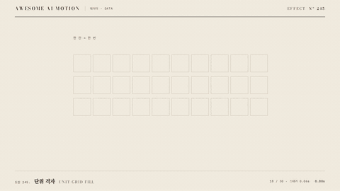

# Nº 245 단위 격자 · Unit Grid Fill



[MP4](clip.mp4) · [HTML](index.html)

**전체를 나타내는 격자에서 해당 개수만 순서대로 채우는 표현**

An animation that fills a specified number of cells in sequence within a grid representing the whole.

| Family | Level | Purpose | Media | Runtime |
|---|---|---|---|---|
| 데이터 · DATA | 기본 | 설명, 데이터 증명 | 설명 영상, 데이터 스토리, 발표 | gsap |

다른 이름 / Also known as: 와플 차트 채움, Waffle chart fill, Hex tile map, 육각 타일 지도, Sequential unit population, 단위 수량 순차 채우기, Unit share recoloring, 단위 비율 색칠

## 선택 기준 / Selection

전체 중 일부의 비율과 실제 개수 / Shows both the proportion and the actual count of a subset.

- 전체 중 일부의 비율과 실제 개수를 보여줄 때 / When showing the proportion and actual count of a subset
- 30칸 중 18칸을 채워 선택 비율 60%를 보여준다와 같은 장면을 만들 때 / When filling 18 of 30 cells to show a selection rate of 60%

좋은 예 / Good: 30칸 중 18칸을 채워 선택 비율 60%를 보여준다
나쁜 예 / Bad: 분모를 생략하고 채워진 칸만 보여 비율을 오해하게 한다
주의 / Avoid: 최종 상태를 0.5초 이상 유지한다 · 동일 화면에서 불필요한 주홍 강조를 추가하지 않는다

## 파라미터 / Parameters

| Parameter | Default | Range | Note |
|---|---|---|---|
| 전체 칸 | 30 | 10~100 | 전체 시행 횟수 |
| 채움 칸 | 18 | 0~30 | 해당 시행 횟수 |
| 스태거 | 0.06s | 0.03~0.09s | 왼쪽에서 오른쪽 순서 |
| 채움 지속 | 0.32s | 0.2~0.5s | 칸 내부 scaleY 사용 |

이징 / Ease: `power2.out`

## 구현 / Implementation (GSAP)

```js
tl.fromTo('.fill',{scaleY:0},{scaleY:1,duration:.32,stagger:.06,ease:'power2.out'},
  .3);
tl.to('.caption',{opacity:1,duration:.3},1.82);
```

## 프롬프트 / Prompts

### 한국어 · Claude Code
```text
<대상>에 단위 격자 효과를 적용해. 30칸 중 18칸을 채워 선택 비율 60%를 보여준다. 전체 칸 30; 채움 칸 18; 스태거 0.06s; 채움 지속 0.32s로 만들고 이징은 power2.out를 써. GSAP 타임라인 하나로 제어하고 2.5초부터 3초까지 완성 상태를 유지해.
```

### 한국어 · Codex
```text
<파일>의 데이터 장면에 단위 격자 효과를 구현해. 전체 칸 30; 채움 칸 18; 스태거 0.06s; 채움 지속 0.32s를 적용하고 이징은 power2.out로 지정해. 0초, 0.75초, 1.75초, 2.9초를 캡처해서 시작 상태와 진행 변화, 최종 상태의 잘림과 겹침을 확인해. Math.random과 타이머 없이 타임라인으로 재생하고 마지막 0.5초 이상 정지해.
```

### English · Claude Code
```text
Apply Unit Grid Fill to <target>. Fill 18 of 30 cells to show a selection rate of 60%. Use these settings: total cells 30; filled cells 18; stagger 0.06s; fill duration 0.32s; ease power2.out. Control everything with a single GSAP timeline and hold the completed state from 2.5 to 3 seconds.
```

### English · Codex
```text
Implement Unit Grid Fill in the data scene in <file>. Use these settings: total cells 30; filled cells 18; stagger 0.06s; fill duration 0.32s; ease power2.out. Capture at 0, 0.75, 1.75, and 2.9 seconds to check the initial state, progression, and any clipping or overlap in the final state. Play using a timeline without Math.random or timers, and hold still for at least the final 0.5 seconds.
```

예시 / Example: 단위 격자를 `.hero`에 적용해. / Apply Unit Grid Fill to `.hero`.

## 적용 / Application

- HyperFrames: 하나의 paused GSAP 타임라인에 모든 동작을 넣고 3초 seek 가능한 장면으로 만든다
- ReelForge: 데이터 도형과 라벨을 분리하고 동일 시작 시각과 지속 시간을 씬 타임라인에 연결한다
- Scrolline Deck: 시간을 스크롤 진행률로 매핑하고 마지막 구간에서 최종값과 주석을 유지한다

조합 / Pair with: [점 재배치 · Dot Regroup](../dot-regroup/) · [카운트업 · Count-up](../count-up/) · [스태거 · Stagger](../stagger/)

출처 / Sources: [GSAP Timeline 공식 문서](https://gsap.com/docs/v3/GSAP/Timeline/) (문서 참조) · [heygen-com/hyperframes](https://raw.githubusercontent.com/heygen-com/hyperframes/main/registry/blocks/us-map-hex/registry-item.json) (Apache-2.0) · [Flourish](https://flourish.studio/visualisations/pictogram-charts/) (unknown) · [reuters-graphics/chart-module-testing-dots](https://github.com/reuters-graphics/chart-module-testing-dots) (unknown) · [d3/d3-interpolate](https://d3js.org/d3-interpolate) (ISC) · motion dictionary 3-type-data-ui.md#15. 단위 격자 채우기 · Unit grid / Waffle fill (own)

[목록 / Catalog](../../references/catalog.md) · [index.json](../../index.json)
