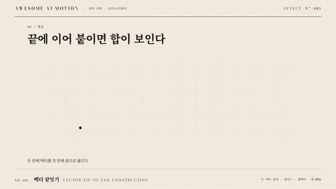

# Nº 403 벡터 끝잇기 · Vector Tip-to-tail Construction



[MP4](clip.mp4) · [HTML](index.html)

**두 성분 벡터를 차례로 늘리고 두 번째를 첫 번째의 끝으로 옮겨 합벡터를 만든다.**

Component vectors extend in sequence, then join tip to tail to form a resultant.

| Family | Level | Purpose | Media | Runtime |
|---|---|---|---|---|
| 원리 도해 · EXPLAINER | 중급 | 설명, 순서·흐름 | 설명 영상, 스크롤덱, 발표 | svg |

다른 이름 / Also known as: 벡터 끝잇기 구성

## 선택 기준 / Selection

벡터 합과 선형 결합을 공간적으로 이해한다. / Explains vector addition and linear combinations spatially.

- 벡터 끝잇기으로 원인과 결과를 설명할 때 / Explain causes and results using vector tip-to-tail construction.
- 대응하는 요소를 같은 화면에서 순서대로 읽게 할 때 / Present corresponding elements in a readable sequence within the same view.

좋은 예 / Good: 두 번째 벡터를 첫 번째 끝에 붙인 뒤 합벡터를 그린다.
나쁜 예 / Bad: 두 벡터를 동시에 옮겨 합의 구성 순서를 숨긴다.
주의 / Avoid: 두 벡터를 동시에 옮겨 합의 구성 순서를 숨긴다. · 설명 라벨과 대응 색을 동작 중에 바꾸지 않는다.

## 파라미터 / Parameters

| Parameter | Default | Range | Note |
|---|---|---|---|
| 기본 지속 | 0.7s | 0.49~0.98s | 첫 동작 또는 후보의 기본 단계 길이 |
| 단계 간격 | 250ms | 150~400ms | 화살표를 읽는 휴지 |
| 이징 | power2.inOut | none \| power2.out \| power2.inOut | 주파수 변화는 선형으로 두고 위치 변화는 완만하게 연결한다. |

## 구현 / Implementation (GSAP)

```js
const tl = gsap.timeline({paused:true});
tl.fromTo(a,{scaleX:0},{scaleX:1,transformOrigin:"0% 50%",duration:0.7});
tl.fromTo(b,{scaleX:0},{scaleX:1,transformOrigin:"0% 50%",duration:0.7},0.95);
tl.to(b,{x:200,y:-80,duration:0.7,ease:"power2.inOut"},1.9);
tl.fromTo(sum,{scaleX:0},{scaleX:1,transformOrigin:"0% 50%",duration:0.7},2.85);
```

## 프롬프트 / Prompts

### 한국어 · Claude Code
```text
<파일>에서 <대상>에 벡터 끝잇기을 적용해. 두 성분 벡터를 차례로 늘리고 두 번째를 첫 번째의 끝으로 옮겨 합벡터를 만든다. SVG 화살표의 길이와 시작점을 순차 보간한다. 기본 지속은 0.7s, 단계 간격은 250ms, 이징은 power2.inOut로 설정한다. 하나의 paused GSAP 타임라인으로 구성하고 seek할 때 좌표와 표시 상태를 다시 계산해.
```

### 한국어 · Codex
```text
<파일>의 설명 장면에서 <대상>에 벡터 끝잇기을 적용해. 기본 지속은 0.7s, 단계 간격은 250ms, 이징은 power2.inOut로 설정한다. 0초, 0.35초, 0.7초 시점을 캡처해 초기 상태, 중간 대응 관계, 첫 동작의 완료 상태를 확인해. 원본과 결과의 의미 대응 및 라벨 가독성을 검증해.
```

### English · Claude Code
```text
Apply Vector Tip-to-tail Construction to <target> in <file>. Component vectors extend in sequence, then join tip to tail to form a resultant. Use a base duration of 0.7s and power2.inOut; use a 250ms gap between stages and preserve semantic correspondence. Build one paused GSAP timeline and recompute geometry and visibility when seeking.
```

### English · Codex
```text
Implement Vector Tip-to-tail Construction in the explanatory scene of <file> for <target>, using 0.7s and power2.inOut with a 250ms gap between stages. Capture at 0, 0.35, and 0.7 seconds to check the initial state, intermediate correspondence, and completion of the first motion. Verify matching source and result elements and readable labels.
```

예시 / Example: 벡터 끝잇기를 `.hero`에 적용해. / Apply Vector Tip-to-tail Construction to `.hero`.

## 적용 / Application

- HyperFrames: 벡터 끝잇기의 계산 상태와 표시를 paused 타임라인 하나에 묶는다. seek 시 onUpdate에서 좌표를 재계산하고 0초 초기 상태도 설정한다.
- ReelForge: 씬 워커 브리프에 벡터 끝잇기, 기본 지속 0.7s, 단계 간격 250ms, 대응 요소의 키와 읽기 순서를 적는다.
- Scrolline Deck: 진행률 0~1을 전체 단계 시간에 매핑해 scrub한다. 단계 간격 250ms를 유지하고 스프링 대신 power2.out을 사용한다.

조합 / Pair with: [선 그리기 · Line Draw](../line-draw/) · [종속 도형 동기 갱신 · Dependent Geometry Update](../dependent-geometry/)

출처 / Sources: [3b1b/videos](https://github.com/3b1b/videos/blob/master/_2016/eola/chapter3.py) (CC-BY-NC-SA-4.0)

[목록 / Catalog](../../references/catalog.md) · [index.json](../../index.json)
