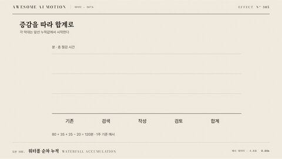

# Nº 305 워터폴 순차 누적 · Waterfall Accumulation



[MP4](clip.mp4) · [HTML](index.html)

**증감 막대가 앞선 누적 끝점에서 차례로 생겨 합계 막대에 도달한다.**

Change bars appear from the preceding cumulative endpoint until a total bar is reached.

| Family | Level | Purpose | Media | Runtime |
|---|---|---|---|---|
| 데이터 · DATA | 중급 | 비교, 데이터 증명 | 설명 영상, 데이터 스토리, 발표 | svg |

## 선택 기준 / Selection

합계가 어떤 더하기와 빼기로 만들어졌는지 이해한다. / Explains the additions and subtractions that produce a total.

- 수익의 증가와 감소를 합계까지 설명할 때 / Explain a revenue bridge with gains and losses.
- 예산 변화의 구성 요소를 순차적으로 보여줄 때 / Trace the components of a budget change to its final total.

좋은 예 / Good: 증감값의 누적 시작점을 계산하고 막대마다 0.45초 공개한 뒤 연결선을 0.18초 그린다.
나쁜 예 / Bad: 음수 막대를 기준선에서 늘려 앞선 합계에서 빠지는 양이 보이지 않는다.
주의 / Avoid: 소계 막대를 다음 누적에 다시 더하지 않는다.

## 파라미터 / Parameters

| Parameter | Default | Range | Note |
|---|---|---|---|
| 막대 공개 | 450ms | 300~700ms | 누적 시작점에서 성장한다. |
| 막대 사이 휴지 | 120ms | 80~220ms | 이전 막대 도착 뒤 기다린다. |
| 연결선 | 180ms | 120~300ms | 앞선 누적 끝점을 연결한다. |
| 막대 간격 | 48px | 32~72px | 라벨과 연결선 공간을 남긴다. |
| 이징 | power2.out | none \| power2.out \| power2.inOut | 끝점을 넘지 않는 이징을 쓴다. |

## 구현 / Implementation (GSAP)

```js
const tl=gsap.timeline({paused:true});
document.querySelectorAll('.waterfall-bar').forEach((el,i)=>{
  const d=el.dataset,t=i*0.75;
  tl.fromTo(el,{attr:{y:+d.startY,height:0}},{attr:{y:+d.finalY,height:+d.finalHeight},duration:0.45,ease:'power2.out'},t);
  const line=document.querySelector('.connector-'+i);
  if(line){const n=line.getTotalLength();tl.fromTo(line,{strokeDasharray:n,strokeDashoffset:n},{strokeDashoffset:0,duration:0.18,ease:'none'},t+0.45);}
});
```

## 프롬프트 / Prompts

### 한국어 · Claude Code
```text
<파일>의 <대상>에 워터폴 순차 누적를 구현해. 증감 막대가 앞선 누적 끝점에서 차례로 생겨 합계 막대에 도달한다. 막대 공개 450ms, 막대 사이 휴지 120ms, 연결선 180ms, 막대 간격 48px, 이징 power2.out를 적용하고 GSAP 코어의 paused 타임라인 하나로 seek 가능하게 작성해. 소계 막대를 다음 누적에 다시 더하지 않는다.
```

### 한국어 · Codex
```text
<파일>의 <대상> 장면에 워터폴 순차 누적를 적용해. 막대 공개 450ms, 막대 사이 휴지 120ms, 연결선 180ms, 막대 간격 48px, 이징 power2.out를 사용하고 다음 동작을 구현해: 누적 기준값을 계산하고 각 SVG 막대와 연결선을 순차 공개한다. 플러그인과 Math.random 없이 작성하고 0.75초·1.8초·3초를 캡처해 초기 상태, 중간 변화, 최종 상태가 연속적이며 다음 예시와 맞는지 확인해: 증감값의 누적 시작점을 계산하고 막대마다 0.45초 공개한 뒤 연결선을 0.18초 그린다.
```

### English · Claude Code
```text
Implement Waterfall Accumulation for <target> in <file>. Change bars appear from the preceding cumulative endpoint until a total bar is reached. Use bar reveal duration: 450ms; pause between bars: 120ms; connector duration: 180ms; bar spacing: 48px; easing: power2.out in a single paused GSAP core timeline that supports seeking. Do not count subtotal bars again in the accumulation.
```

### English · Codex
```text
Apply Waterfall Accumulation to the <target> scene in <file> using bar reveal duration: 450ms; pause between bars: 120ms; connector duration: 180ms; bar spacing: 48px; easing: power2.out. Change bars appear from the preceding cumulative endpoint until a total bar is reached. Use prepared data or geometry with GSAP core, no plugins, and no Math.random; capture at 0.75, 1.8, 3 seconds to verify continuous intermediate geometry, correct endpoints, and identical output after repeated seeks. Do not count subtotal bars again in the accumulation.
```

예시 / Example: 워터폴 순차 누적를 `.hero`에 적용해. / Apply Waterfall Accumulation to `.hero`.

## 적용 / Application

- HyperFrames: paused 타임라인 하나에 워터폴 순차 누적 상태를 넣고 seek(t)로 3초 구간을 재현한다. 현재 시간에서 도형을 계산해 프레임 누적을 피한다.
- ReelForge: 씬 워커 브리프에 막대 공개 450ms, 막대 사이 휴지 120ms, 연결선 180ms, 막대 간격 48px, 이징 power2.out를 싣고 입력 자료와 초기 도형 좌표를 고정한다. 증감값의 누적 시작점을 계산하고 막대마다 0.45초 공개한 뒤 연결선을 0.18초 그린다.
- Scrolline Deck: 진행률 0~1을 3초 구간에 매핑해 같은 타임라인을 scrub한다. 시간량은 none, 시각 전환은 power2.out을 쓰고 스프링 대신 끝점을 넘지 않는 ease-out을 쓴다.

조합 / Pair with: [카운트업 · Count-up](../count-up/) · [선 그리기 · Line Draw](../line-draw/)

출처 / Sources: [Flourish](https://flourish.studio/visualisations/) (unknown) · [apache/echarts](https://echarts.apache.org/handbook/en/how-to/animation/transition/) (Apache-2.0)

[목록 / Catalog](../../references/catalog.md) · [index.json](../../index.json)
