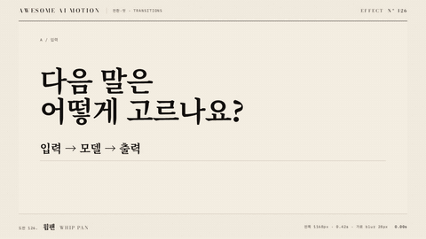

# Nº 126 휩팬 · Whip Pan



[MP4](clip.mp4) · [HTML](index.html)

**장면을 빠르게 수평으로 쓸며 가로 블러와 급감속으로 다음 장면에 안착하는 전환**

A rapid horizontal sweep with horizontal blur and sharp deceleration settles into the next scene.

| Family | Level | Purpose | Media | Runtime |
|---|---|---|---|---|
| 전환·컷 · TRANSITIONS | 중급 | 전환, 순서·흐름 | 설명 영상, 숏폼, 발표 | gsap |

다른 이름 / Also known as: 스위시 팬, Swish pan, 휘프 팬, whip-pan-cut-mask, whip-pan-directional, hypercut-whip, Whip pan cut

## 선택 기준 / Selection

카메라가 빠르게 방향을 돌려 다음 정보로 시선을 이동시킨다 / Moves attention to the next information as if the camera rapidly pans.

- 질문에서 결과로 빠르게 넘어갈 때 / Move quickly from a question to a result.
- 연속 장면의 속도감과 방향을 유지할 때 / Maintain speed and direction across consecutive scenes.

좋은 예 / Good: 질문 장면이 왼쪽으로 쓸려 나가고 확률 장면이 같은 속도로 들어와 선명하게 멈춘다
나쁜 예 / Bad: 장면 A와 B가 반대 방향으로 움직이거나 도착 뒤에도 블러가 남는다
주의 / Avoid: 블러는 이동 축에만 적용한다 · 정착 시 블러를 0으로 복원한다 · 빠른 전환을 연속 반복하지 않는다

## 파라미터 / Parameters

| Parameter | Default | Range | Note |
|---|---|---|---|
| 이동 거리 | -1168px | 장면 너비의 -1배 | A와 B를 한 스트립에 나란히 배치 |
| 전환 시간 | 0.42s | 0.3~0.6s | 급가속과 급감속이 짧게 이어진다 |
| 최대 가로 블러 | 28px | 16~36px | 세로 블러는 0px |
| 시작 시각 | 1.03s | 0.6~1.2s | 전환 전 문장을 읽을 시간 |

이징 / Ease: `power4.inOut`

## 구현 / Implementation (GSAP)

```js
const blur = {x:0};
const updateBlur = () => document.querySelector('#blur-x').setAttribute('stdDeviation', `${blur.x} 0`);
tl.to('.strip', {x:-1168, duration:0.42, ease:'power4.inOut'}, 1.03);
tl.to(blur, {x:28, duration:0.21, ease:'power3.in', onUpdate:updateBlur}, 1.03);
tl.to(blur, {x:0, duration:0.21, ease:'power3.out', onUpdate:updateBlur}, 1.24);
```

## 프롬프트 / Prompts

### 한국어 · Claude Code
```text
<대상>에 왼쪽 휩팬 전환을 만들어줘. 너비 1168px인 A와 B를 한 스트립에 나란히 두고 1.03초부터 0.42초간 x 0에서 -1168px로 power4.inOut 이동시켜. SVG feGaussianBlur의 stdDeviation은 프록시 tween으로 가로 0에서 28px로 0.21초간 증가한 뒤 0.21초간 0으로 복원하고 세로는 0으로 유지해. 1.95초 이후 완성 상태로 정지해.
```

### 한국어 · Codex
```text
<파일>의 두 장면을 2336×580px 스트립 안에 left 0과 1168px로 배치해. 1.03초부터 0.42초간 power4.inOut으로 스트립 x를 -1168px까지 움직이고 SVG 가로 블러 프록시는 1.24초에 28px, 1.45초에 0px가 되게 해. 0.73초, 1.23초, 1.45초, 2.9초 캡처로 A와 B가 같은 방향으로 움직이고 가로만 흐려지며 최종 장면이 선명하게 유지되는지 확인해.
```

### English · Claude Code
```text
Create a leftward whip-pan transition for <target>. Place A and B, each 1168px wide, side by side in one strip. Starting at 1.03 seconds over 0.42 seconds, animate x from 0 to -1168px with power4.inOut. Tween a proxy for SVG feGaussianBlur stdDeviation, increasing horizontal blur from 0 to 28px over 0.21 seconds, then restoring it to 0 over 0.21 seconds. Keep vertical blur at 0. Hold the completed state after 1.95 seconds.
```

### English · Codex
```text
Place the two scenes in <file> at left 0 and 1168px inside a 2336×580px strip. Starting at 1.03 seconds over 0.42 seconds, animate the strip x to -1168px with power4.inOut. Set the SVG horizontal blur proxy to reach 28px at 1.24 seconds and 0px at 1.45 seconds. Capture at 0.73, 1.23, 1.45, and 2.9 seconds to verify that A and B move in the same direction, only horizontal blur appears, and the final scene remains sharp.
```

예시 / Example: 휩팬를 `.hero`에 적용해. / Apply Whip Pan to `.hero`.

## 적용 / Application

- HyperFrames: 장면 안쪽 래퍼를 paused GSAP 타임라인 하나로 움직인다. 3초 길이에서 마지막 0.5초 이상을 홀드한다.
- ReelForge: 전환 전후 장면을 동시에 배치하고 이동·마스크·색 변화의 시작과 끝을 같은 시간축에 둔다.
- Scrolline Deck: 전환 시간을 스크롤 진행률로 환산한다. 역방향 seek에도 시작 상태가 복원되게 초기값을 타임라인에 둔다.

조합 / Pair with: [푸시 전환 · Push](../push-transition/) · [팬 · Pan](../pan/) · [예비동작 · Anticipation](../anticipation/)

출처 / Sources: [GSAP Timeline 공식 문서](https://gsap.com/docs/v3/GSAP/Timeline/) (공식 문서 개념 참조) · [heygen-com/hyperframes](https://raw.githubusercontent.com/heygen-com/hyperframes/main/registry/blocks/whip-pan/registry-item.json) (Apache-2.0) · [heygen-com/hyperframes](https://raw.githubusercontent.com/heygen-com/hyperframes/main/registry/components/whip-pan-cut/registry-item.json) (Apache-2.0) · [Adobe](https://helpx.adobe.com/premiere/desktop/add-video-effects/effects-and-transitions-library/list-of-video-transitions.html) (unknown) · [remotion-dev/remotion](https://www.remotion.dev/docs/transitions/presentations/blur-slide) (Remotion License)

[목록 / Catalog](../../references/catalog.md) · [index.json](../../index.json)
