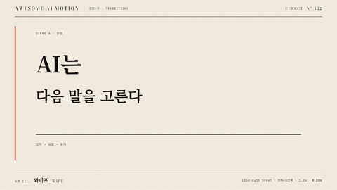

# Nº 122 와이프 · Wipe



[MP4](clip.mp4) · [HTML](index.html)

**이동하는 경계 뒤로 새 장면을 순서대로 공개하는 전환**

A moving boundary progressively reveals the new scene behind it.

| Family | Level | Purpose | Media | Runtime |
|---|---|---|---|---|
| 전환·컷 · TRANSITIONS | 기본 | 전환, 순서·흐름 | 설명 영상, 숏폼, 발표, 스크롤덱 | gsap |

다른 이름 / Also known as: 방향 전환, Diagonal split, 대각 분할 전환, Cover wipe, 가림막 와이프, Shutter, 셔터 전환, Diagonal Wipe

## 선택 기준 / Selection

같은 방향의 경계 이동이 새 장면의 진입을 보여준다 / Communicates the entrance of a new scene through a boundary moving in a consistent direction.

- 왼쪽부터 오른쪽으로 정보의 순서를 보여줄 때 / Present information in order from left to right.
- 장면 경계를 뚜렷하게 보이면서 내용 전체를 교체할 때 / Replace the entire scene while keeping the transition boundary visible.

좋은 예 / Good: 주홍 세로선이 1.2초 동안 오른쪽으로 지나가며 후보 확률 장면이 드러난다
나쁜 예 / Bad: 세로선은 이동하지만 새 장면은 전체가 한꺼번에 나타난다
주의 / Avoid: 경계선과 clip-path의 진행률을 따로 움직이지 않는다 · 전환 중 주홍 대상 여러 개를 추가하지 않는다

## 파라미터 / Parameters

| Parameter | Default | Range | Note |
|---|---|---|---|
| 전환 시작 | 0.35s | 0.3~0.8s | 시작 상태 확인 |
| 전환 지속 | 1.2s | 0.7~1.5s | 이동하는 경계가 보이는 시간 |
| 마스크 | inset(0% 100% 0% 0%) → inset(0% 0% 0% 0%) | 오른쪽 inset 100~0% | 왼쪽에서 공개 |
| 경계 이동 | 1164px | 무대 폭에서 선 폭 제외 | 4px 선을 마지막에도 유지 |

이징 / Ease: `none`

## 구현 / Implementation (GSAP)

```js
tl.to('#B', {clipPath:'inset(0% 0% 0% 0%)', duration:1.2, ease:'none'}, 0.35);
tl.to('#edge', {x:1164, duration:1.2, ease:'none'}, 0.35);
tl.to('.lead', {opacity:1, duration:0.2}, 1.7);
```

## 프롬프트 / Prompts

### 한국어 · Claude Code
```text
<대상>의 두 장면을 겹쳐 두고 B의 clip-path를 inset(0% 100% 0% 0%)로 시작해줘. 0.35초부터 1.2초 동안 오른쪽 inset을 0%로 바꾸고 4px 주홍 세로선을 x 0에서 1164px로 같이 움직여줘. 이징은 none, 전체 길이는 3초로 하고 1.9초 이후 완성 상태를 정지해.
```

### 한국어 · Codex
```text
<파일>에 왼쪽에서 오른쪽으로 진행하는 와이프를 적용해. B clip-path inset 오른쪽 100%→0%와 4px 세로선 x 0→1164를 0.35초에 시작해 1.2초 동안 none으로 움직여. 0.23초, 0.73초, 1.23초, 2.9초 캡처에서 경계 뒤에는 B, 앞에는 A가 보이며 끝에 B 전체가 유지되는지 확인해.
```

### English · Claude Code
```text
Overlay the two scenes in <target> and start B with clip-path inset(0% 100% 0% 0%). Starting at 0.35 seconds over 1.2 seconds, animate the right inset to 0% while moving a 4px vermilion vertical line from x 0 to 1164px. Use ease none and a total duration of 3 seconds. Hold the completed state after 1.9 seconds.
```

### English · Codex
```text
Apply a left-to-right wipe in <file>. Starting at 0.35 seconds over 1.2 seconds with ease none, animate B's right clip-path inset from 100% to 0% and a 4px vertical line from x 0 to 1164. Capture at 0.23, 0.73, 1.23, and 2.9 seconds to verify B behind the boundary, A ahead of it, and the full scene B holding at the end.
```

예시 / Example: 와이프를 `.hero`에 적용해. / Apply Wipe to `.hero`.

## 적용 / Application

- HyperFrames: 장면 둘을 같은 좌표에 배치하고 하나의 paused GSAP 타임라인으로 전환한다. 전환 뒤 완성 장면을 홀드한다
- ReelForge: 전환 비트의 시작 시각과 지속 시간을 고정하고 장면 레이어 두 개를 함께 렌더한다
- Scrolline Deck: 전환 구간의 진행률을 하나의 타임라인에 연결하고 양 끝에 읽기 위한 정지 구간을 둔다

조합 / Pair with: [푸시 전환 · Push](../push-transition/) · [마스크 리빌 · Mask Reveal](../mask-reveal/) · [크로스페이드 · Crossfade](../crossfade/)

출처 / Sources: [Wipe (transition)](https://en.wikipedia.org/wiki/Wipe_(transition)) (개념 인용) · [heygen-com/hyperframes](https://raw.githubusercontent.com/heygen-com/hyperframes/main/registry/blocks/transitions-cover/registry-item.json) (Apache-2.0) · [heygen-com/hyperframes](https://raw.githubusercontent.com/heygen-com/hyperframes/main/registry/blocks/lt-clean-bar/registry-item.json) (Apache-2.0) · [heygen-com/hyperframes](https://raw.githubusercontent.com/heygen-com/hyperframes/main/registry/blocks/lt-bold-block/registry-item.json) (Apache-2.0) · [heygen-com/hyperframes](https://raw.githubusercontent.com/heygen-com/hyperframes/main/registry/blocks/lt-stack-bars/registry-item.json) (Apache-2.0) · [heygen-com/hyperframes](https://raw.githubusercontent.com/heygen-com/hyperframes/main/registry/blocks/lower-third-bild/registry-item.json) (Apache-2.0) · [motion.dev examples](https://motion.dev/examples/react-footer-reveal) (unknown) · [greensock/GSAP](https://gsap.com/docs/v3/Plugins/ScrollTrigger/) (GSAP Standard License)

[목록 / Catalog](../../references/catalog.md) · [index.json](../../index.json)
