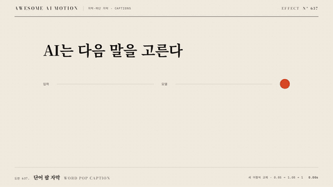

# Nº 637 단어 팝 자막 · Word Pop Caption



[MP4](clip.mp4) · [HTML](index.html)

**말하는 단어가 차례로 작게 튀어 오르며 짧은 자막 묶음이 되는 효과**

Each spoken word pops in turn to form short caption groups.

| Family | Level | Purpose | Media | Runtime |
|---|---|---|---|---|
| 자막·하단 자막 · CAPTIONS | 기본 | 주목 끌기, 피드백 | 숏폼, 설명 영상 | gsap |

다른 이름 / Also known as: Word Pop Captions, Single Word Caption Replacement, 한 단어 자막 교체

## 선택 기준 / Selection

빠른 발화에서도 강세와 읽는 위치를 알려 준다. 숏폼에서 말의 리듬이 눈에 보인다 / Signals stress and reading position even in fast speech, making the rhythm of talk visible in short-form video.

- 틱톡·릴스 스타일 자막이 필요할 때 / Make TikTok or Reels style captions.
- 말이 빠른 영상에서 핵심 단어를 강조할 때 / Emphasize key words in fast-paced speech.

좋은 예 / Good: 한 페이지 3단어가 발화 시각에 160ms로 scale 0.85에서 1.08을 거쳐 1로 튀고 페이지가 끝나면 다음 3단어로 교체된다
나쁜 예 / Bad: 모든 단어를 1.3배로 크게 튀겨 화면이 흔들리고 이전 단어가 사라지지 않고 쌓인다
주의 / Avoid: scale 최대 1.15 초과 금지 · 한 페이지 2~5단어 유지 · 자막은 안전 영역(하단 22%) 안에 둔다

## 파라미터 / Parameters

| Parameter | Default | Range | Note |
|---|---|---|---|
| 팝 시간 | 160ms | 120~220ms | 한 단어 |
| scale | 0.85→1.08→1 | 0.8→1.12 | 튀는 폭 |
| 페이지 단어 수 | 3 | 2~5 | 한 화면 |
| 이징 | back.out(2) | power2.out~back.out(2.5) | 살짝 넘침 |

## 구현 / Implementation (GSAP)

```js
words.forEach(w => {
  tl.fromTo(w.el, { scale: 0.85, opacity: 0 },
    { scale: 1, opacity: 1, duration: 0.16, ease: 'back.out(2)' }, w.start);
});
pages.forEach(p => tl.set(p.el, { autoAlpha: 0 }, p.end));
```

## 프롬프트 / Prompts

### 한국어 · Claude Code
```text
<대상> 자막을 단어 팝 방식으로 만들어줘. <타임스탬프 JSON>의 단어를 한 페이지 3단어로 묶고(한글은 어절 단위), 각 단어가 start 시각에 0.16초 동안 scale 0.85에서 1로 back.out(2)로 튀며 나타나게 해. 페이지가 끝나면 즉시 다음 페이지로 교체하고 이전 단어가 남지 않게 해. 화면 하단 22% 안전 영역에 배치.
```

### 한국어 · Codex
```text
<파일>의 단어 span에 fromTo(scale 0.85→1, opacity 0→1, 0.16s, back.out(2))를 start 시각에 걸고 페이지 종료 시 autoAlpha 0. 페이지 경계 전후 캡처로 이전 단어가 남지 않았는지, 단어 start+0.08초 프레임에서 scale이 1.0을 넘는지 확인해.
```

### English · Claude Code
```text
Build word-pop captions in <target>. Group the words in <timestamp JSON> into pages of 3 (for Korean, per eojeol) and pop each word at its start time over 0.16 seconds from scale 0.85 to 1 with back.out(2). At the end of a page replace it immediately with the next so no earlier word remains. Place in the bottom 22% safe zone.
```

### English · Codex
```text
In <file> add fromTo (scale 0.85 to 1, opacity 0 to 1, 0.16s, back.out(2)) at each word start and autoAlpha 0 at page end. Capture around a page boundary to confirm no earlier word remains, and at word start + 0.08s to confirm the scale is above 1.0.
```

예시 / Example: 단어 팝 자막를 `.hero`에 적용해. / Apply Word Pop Caption to `.hero`.

## 적용 / Application

- HyperFrames: 단어 start를 tl position에 넣는다. 페이지 교체는 tl.set autoAlpha로 하고 한글은 어절 단위 span으로 둔다
- ReelForge: 캡션 씬에 단어 타임스탬프, 페이지 크기 3, 팝 스타일을 파라미터로 전달한다
- Scrolline Deck: 스크롤 자막은 드물다. 쓰면 scale 넘침(back)을 빼고 power2.out으로 바꾼다

조합 / Pair with: [카라오케 자막 · Karaoke Caption](../karaoke-caption/) · [자막 페이지 교체 · Caption Page Swap](../caption-page-swap/) · [스케일 팝 · Scale Pop](../scale-pop/)

출처 / Sources: [remotion-dev/remotion](https://www.remotion.dev/templates/tiktok) (Remotion License (custom)) · [remotion-dev/remotion](https://www.remotion.dev/docs/captions/create-tiktok-style-captions) (Remotion License (custom))

[목록 / Catalog](../../references/catalog.md) · [index.json](../../index.json)
