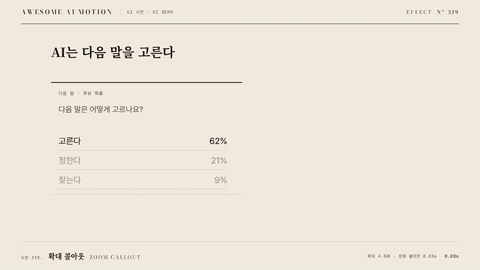

# Nº 319 확대 콜아웃 · Zoom Callout



[MP4](clip.mp4) · [HTML](index.html)

**작은 UI의 수치를 옆의 원형 확대 영역으로 띄우고 두 위치를 선으로 잇는 동작**

An animation that enlarges a small UI value in an adjacent circular callout and connects both locations with a line.

| Family | Level | Purpose | Media | Runtime |
|---|---|---|---|---|
| UI 시연 · UI DEMO | 중급 | 설명, 강조 | 제품 시연, 설명 영상, 웹 UI | gsap |

다른 이름 / Also known as: 확대 돋보기, Magnifying Lens, 확대 렌즈, Magnified callout / UI focus zoom, Zoom inset / Detail view, 줌 인셋, Chart zoomed detail inset, 차트 세부 확대 창

## 선택 기준 / Selection

전체 화면 속 세부 수치의 위치와 값 / Shows the location and value of a small detail within the overall screen.

- 작은 후보 목록의 62%를 원형 콜아웃 안에서 4.5배 글자 크기로 보여 준다 / When showing 62% from a small candidate list in a circular callout at 4.5 times the text size
- 전체 화면 속 세부 수치의 위치와 값을 보여 줄 때 / When showing the location and value of a detail within the overall screen

좋은 예 / Good: 작은 후보 목록의 62%를 원형 콜아웃 안에서 4.5배 글자 크기로 보여 준다
나쁜 예 / Bad: 원본과 다른 값을 확대하거나 연결선이 다른 후보를 가리킨다
주의 / Avoid: 원본과 다른 값을 확대하거나 연결선이 다른 후보를 가리킨다 · 동작 종료 뒤 최소 0.5초 읽기 시간을 둔다

## 파라미터 / Parameters

| Parameter | Default | Range | Note |
|---|---|---|---|
| 확대 글자 비율 | 4.5배 | 2.5~5배 | 23px에서 104px로 수치 확대 |
| 원 지름 | 330px | 260~380px | 원본 화면 옆에 배치 |
| 등장 지속 | 0.85s | 0.5~1s | scale 0.25에서 1로 확대 |
| 가로 등장 이동 | 120px | 60~160px | 원본 쪽에서 옆으로 떠오름 |
| 연결선 | 0.65s | 0.4~0.8s | pathLength 1로 선 그리기 |

이징 / Ease: `power3.out`

## 구현 / Implementation (GSAP)

```js
const tl = Motion.timeline();
tl.to('.source',{opacity:1,duration:.25},.3);
tl.to('.connector path',{strokeDashoffset:0,autoRound:false,duration:.65,ease:'power2.out'},.6);
tl.fromTo('.lens',{x:-120,scale:.25,opacity:0},{x:0,scale:1,opacity:1,duration:.85,ease:'power3.out'},.65);
tl.to('.lead',{opacity:1,duration:.25},1.7);
```

## 프롬프트 / Prompts

### 한국어 · Claude Code
```text
<대상>의 후보 목록에서 고른다 62%를 오른쪽 원형 돋보기로 확대해줘. 원본은 23px, 확대 수치는 104px이고 원 지름은 330px로 해. 0.65초부터 0.85초 동안 x -120px, scale 0.25, opacity 0에서 x 0, scale 1, opacity 1로 power3.out 등장하고 두 위치를 0.65초에 그리는 가는 선으로 이어 줘.
```

### 한국어 · Codex
```text
<파일>의 후보 목록 옆에 지름 330px 원형 콜아웃을 배치해. 원본 62% 위치를 먹색 원으로 표시하고 pathLength 1 선의 strokeDashoffset을 0.6초부터 0.65초 동안 1에서 0으로 바꿔. 돋보기는 0.65~1.5초에 scale 0.25에서 1로 등장시키고 0.23초, 0.73초, 1.73초, 2.9초 캡처로 원본과 확대 수치의 일치, 연결선, 완성 홀드를 확인해.
```

### English · Claude Code
```text
Enlarge "picks 62%" from the candidate list in <target> in a circular magnifier on the right. Use 23px text for the original, 104px for the enlarged value, and a circle diameter of 330px. Starting at 0.65 seconds, animate from x -120px, scale 0.25, opacity 0 to x 0, scale 1, opacity 1 over 0.85 seconds with power3.out. Connect the two locations with a thin line drawn over 0.65 seconds.
```

### English · Codex
```text
Place a circular callout with diameter 330px beside the candidate list in <file>. Mark the original 62% position with an ink-black circle, and change strokeDashoffset on a pathLength 1 line from 1 to 0 over 0.65 seconds starting at 0.6 seconds. Reveal the magnifier from scale 0.25 to 1 between 0.65 and 1.5 seconds. Capture at 0.23, 0.73, 1.73, and 2.9 seconds to check that the original and enlarged values match, the connector line, and the final hold.
```

예시 / Example: 확대 콜아웃를 `.hero`에 적용해. / Apply Zoom Callout to `.hero`.

## 적용 / Application

- HyperFrames: 공용 하네스의 paused 타임라인에 모든 동작을 넣어 초 단위 seek로 검증한다
- ReelForge: UI 요소와 강조 요소를 분리하고 동일한 타이밍 수치를 씬 파라미터로 옮긴다
- Scrolline Deck: 3초 타임라인을 스크롤 진행률 0~1로 매핑하고 마지막 0.5초에 완성 상태를 유지한다

조합 / Pair with: [좌표 줌 · Zoom to Detail](../zoom-to-detail/) · [주석 등장 · Annotation Callout](../annotation-callout/) · [스포트라이트 · Spotlight](../spotlight/)

출처 / Sources: [GSAP Timeline 공식 문서](https://gsap.com/docs/v3/GSAP/Timeline/) (공식 문서 개념 참조) · [magicuidesign/magicui](https://magicui.design/docs/components/lens) (MIT) · [ui.aceternity.com](https://ui.aceternity.com/components/lens) (unknown) · motion dictionary 3-type-data-ui.md#26. 확대 콜아웃 · Magnified callout / UI focus zoom (own) · motion dictionary 3-type-data-ui.md#16. 줌 인셋 · Zoom inset / Detail view (own) · [d3/d3-zoom](https://d3js.org/d3-zoom) (ISC) · [Screen Studio](https://screen.studio/) (unknown) · [Heer & Robertson 2007](https://sites.stat.columbia.edu/gelman/communication/HeerRobertson2007.pdf) (unknown)

[목록 / Catalog](../../references/catalog.md) · [index.json](../../index.json)
