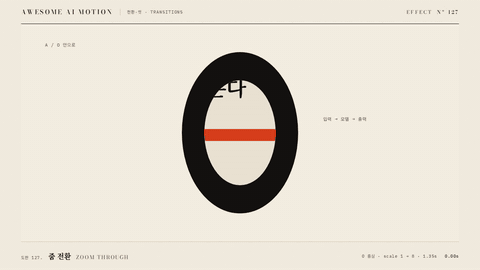

# Nº 127 줌 전환 · Zoom Through



[MP4](clip.mp4) · [HTML](index.html)

**글자 O의 구멍을 확대해 그 안의 다음 장면으로 통과하는 전환**

The opening in the letter O enlarges to carry the viewer through to the next scene inside it.

| Family | Level | Purpose | Media | Runtime |
|---|---|---|---|---|
| 전환·컷 · TRANSITIONS | 중급 | 전환, 순서·흐름 | 설명 영상, 숏폼, 발표 | gsap |

다른 이름 / Also known as: 줌 스루, Zoom transition, 줌 통과, 줌 관통, zoom-through-portal, Cross zoom, 교차 줌

## 선택 기준 / Selection

같은 중심을 향해 깊이 들어가며 다음 정보로 연결된다 / Connects to the next information by moving deeper toward a shared center.

- 제목의 글자 내부를 다음 장면의 입구로 사용할 때 / Use the inside of a title letter as an entrance to the next scene.
- 전체 개요에서 확률 같은 세부 정보로 들어갈 때 / Move from an overview into details such as probabilities.

좋은 예 / Good: O 중심을 고정한 채 8배 확대해 구멍 안에서 후보 확률 장면이 드러난다
나쁜 예 / Bad: 구멍과 카메라의 중심이 달라 O의 먹 면이 화면을 가린다
주의 / Avoid: 구멍 밖에서 다음 장면이 먼저 노출되지 않게 한다 · 확대 중 중심을 옮기지 않는다

## 파라미터 / Parameters

| Parameter | Default | Range | Note |
|---|---|---|---|
| 확대 배율 | 8 | 6~12 | 구멍이 장면의 네 모서리를 덮는 배율 |
| 확대 시간 | 1.35s | 0.8~1.5s | 출발은 천천히, 끝은 빠르게 |
| 시작 시각 | 0.4s | 0.3~0.5s | O를 먼저 읽는 준비 시간 |
| 다음 장면 초기 배율 | 0.18 | 0.12~0.3 | 구멍 속 먼 장면으로 시작 |

이징 / Ease: `power3.in / power2.out`

## 구현 / Implementation (GSAP)

```js
tl.set('.content', {scale:0.18, opacity:0});
tl.to('.a', {scale:8, duration:1.35, ease:'power3.in'}, 0.4);
tl.to('.content', {opacity:1, duration:0.25}, 0.7);
tl.to('.content', {scale:1, duration:1.15, ease:'power2.out'}, 0.7);
tl.set('.a', {opacity:0}, 1.75);
```

## 프롬프트 / Prompts

### 한국어 · Claude Code
```text
<대상>에 글자 O를 통과하는 줌 전환을 만들어줘. 1168×580 장면의 중심 584px, 290px에 구멍 반경 95px, 140px인 O를 두고 0.4초부터 1.35초간 power3.in으로 8배 확대해. 구멍 아래 장면은 0.7초부터 1.15초간 0.18배에서 1배로 확대하고 2.25초 이후 정지해.
```

### 한국어 · Codex
```text
<파일>의 장면 전환에 중심 584px, 290px의 O 마스크 래퍼를 적용해. 0.4초부터 scale 1에서 8로 1.35초간 power3.in으로 움직이고 다음 장면은 0.7초부터 1.15초간 scale 0.18에서 1로 움직여. 0.23초, 1.23초, 1.73초, 2.9초를 캡처해 O의 구멍 안에만 장면 B가 드러나고 마지막에 먹 테두리 없이 완성 상태가 남는지 확인해.
```

### English · Claude Code
```text
Create a zoom-through transition through the letter O for <target>. Place an O with opening radii 95px and 140px at the center of a 1168×580 scene, at 584px, 290px. Starting at 0.4 seconds over 1.35 seconds, enlarge it to 8 times its size with power3.in. Scale the scene beneath the opening from 0.18 to 1 starting at 0.7 seconds over 1.15 seconds, and hold after 2.25 seconds.
```

### English · Codex
```text
Apply an O mask wrapper centered at 584px, 290px to the scene transition in <file>. Starting at 0.4 seconds over 1.35 seconds, animate scale from 1 to 8 with power3.in. Animate the next scene from scale 0.18 to 1 starting at 0.7 seconds over 1.15 seconds. Capture at 0.23, 1.23, 1.73, and 2.9 seconds to verify that scene B appears only inside the O opening and that the completed state remains without an ink-black border at the end.
```

예시 / Example: 줌 전환를 `.hero`에 적용해. / Apply Zoom Through to `.hero`.

## 적용 / Application

- HyperFrames: 장면 안쪽 래퍼를 paused GSAP 타임라인 하나로 움직인다. 3초 길이에서 마지막 0.5초 이상을 홀드한다.
- ReelForge: 전환 전후 장면을 동시에 배치하고 이동·마스크·색 변화의 시작과 끝을 같은 시간축에 둔다.
- Scrolline Deck: 전환 시간을 스크롤 진행률로 환산한다. 역방향 seek에도 시작 상태가 복원되게 초기값을 타임라인에 둔다.

조합 / Pair with: [푸시인 · Push-in](../push-in/) · [좌표 줌 · Zoom to Detail](../zoom-to-detail/) · [매치컷 · Match Cut](../match-cut/)

출처 / Sources: [GSAP Timeline 공식 문서](https://gsap.com/docs/v3/GSAP/Timeline/) (공식 문서 개념 참조) · [heygen-com/hyperframes](https://raw.githubusercontent.com/heygen-com/hyperframes/main/registry/components/zoom-through-transition/registry-item.json) (Apache-2.0) · [heygen-com/hyperframes](https://raw.githubusercontent.com/heygen-com/hyperframes/main/registry/blocks/cinematic-zoom/registry-item.json) (Apache-2.0) · [heygen-com/hyperframes](https://raw.githubusercontent.com/heygen-com/hyperframes/main/registry/blocks/transitions-scale/registry-item.json) (Apache-2.0) · [heygen-com/hyperframes](https://raw.githubusercontent.com/heygen-com/hyperframes/main/registry/components/shared-axis-z/registry-item.json) (Apache-2.0) · [pixel-point/animate-text](https://raw.githubusercontent.com/pixel-point/animate-text/master/skills/animate-text/assets/specs/shared-axis-z.json) (unknown) · [helpx.adobe.com](https://helpx.adobe.com/after-effects/desktop/work-with-layers/camera-layer/cameras-lights-points-interest.html) (unknown) · [Kurzgesagt](https://kurzgesagt.org/what-we-do?visit=videos) (unknown)

[목록 / Catalog](../../references/catalog.md) · [index.json](../../index.json)
