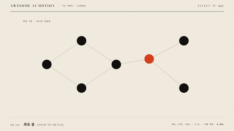

# Nº 223 좌표 줌 · Zoom to Detail



[MP4](clip.mp4) · [HTML](index.html)

**전체 도해의 특정 좌표를 화면 중심으로 옮기며 확대하고 세부 정보를 드러내는 움직임**

A motion that centers and enlarges a specific coordinate in an overview diagram to reveal detail.

| Family | Level | Purpose | Media | Runtime |
|---|---|---|---|---|
| 가상 카메라 · CAMERA | 중급 | 강조, 설명 | 설명 영상, 발표, 스크롤덱 | gsap |

다른 이름 / Also known as: 좌표 중심 확대, 상세 줌, Area zoom handoff, 영역 줌 연결, zoomInTransition, zoomOutTransition, Focus zoom / Reframing, 포커스 줌·리프레임

## 선택 기준 / Selection

전체와 부분의 관계를 보존하며 자세한 설명으로 들어간다 / Moves into a detailed explanation while preserving the relationship between the whole and its parts.

- 노드나 지도 전체에서 하나의 대상 상세를 보여줄 때 / When showing details of one subject within a node diagram or map
- 전체 구조를 먼저 보여준 뒤 선택 지점을 설명할 때 / When explaining a selected point after showing the overall structure

좋은 예 / Good: 7개 노드 중 주홍 노드 좌표를 중심으로 2.6배 확대하고 고른다 62% 라벨을 표시한다
나쁜 예 / Bad: 확대 전에 상세 라벨이 등장하거나 선택 좌표가 화면 밖으로 빠진다
주의 / Avoid: 확대 전에 상세 라벨이 등장하거나 선택 좌표가 화면 밖으로 빠진다 · 최종 상태를 0.5초 미만으로 유지하지 않는다

## 파라미터 / Parameters

| Parameter | Default | Range | Note |
|---|---|---|---|
| 선택 좌표 | 760px 260px | 도해 내부 좌표 | transform-origin과 동일 |
| 확대율 | 2.6 | 2.0~3.2 | 전체에서 한 노드로 |
| 재중심 이동 | x -176px / y 0px | 대상 좌표 기준 | 최종 노드 x는 584px |
| 확대 시간 | 1.75s | 1.3~1.9s | 0.3초에 출발 |
| 라벨 등장 | 2.05s / 0.3s | 확대 완료 뒤 0.2~0.4s | 홀드 시작은 2.35초 |

이징 / Ease: `power2.inOut`

## 구현 / Implementation (GSAP)

```js
tl.to('#map', {scale: 2.6, x: -176, y: 0, duration: 1.75, ease: 'power2.inOut'}, .3);
tl.to('#detail', {opacity: 1, duration: .3}, 2.05);
```

## 프롬프트 / Prompts

### 한국어 · Claude Code
```text
<대상>에 좌표 줌 효과를 GSAP 코어로 만들어줘. 7개 노드 중 주홍 노드 좌표를 중심으로 2.6배 확대하고 고른다 62% 라벨을 표시한다 3초 클립에서 0.3초까지 시작 상태를 유지하고 다음 기본값을 적용해: 선택 좌표 760px 260px, 확대율 2.6, 재중심 이동 x -176px / y 0px, 확대 시간 1.75s, 라벨 등장 2.05s / 0.3s. 마지막 0.5초 이상은 완성 상태로 정지하고 시간 제어는 paused 타임라인 하나로 해.
```

### 한국어 · Codex
```text
<파일>의 scene 내부에 좌표 줌를 적용해. 선택 좌표는 760px 260px. 확대율는 2.6. 재중심 이동는 x -176px / y 0px. 확대 시간는 1.75s. 라벨 등장는 2.05s / 0.3s. 0.23초, 1.23초, 2.9초를 캡처해 시작 상태와 중간 변화, 7개 노드 중 주홍 노드 좌표를 중심으로 2.6배 확대하고 고른다 62% 라벨을 표시한다의 최종 상태를 확인해. 2.5초와 2.9초의 장면이 같은지, 의도한 카메라 프레임 외의 잘림과 라벨 겹침이 없는지 검증해.
```

### English · Claude Code
```text
Create a Zoom to Detail effect on <target> using GSAP core. Zoom to 2.6 times the scale around the vermilion node among 7 nodes and display the label "picks 62%". In a 3-second clip, hold the initial state until 0.3 seconds and apply these defaults: selected coordinate 760px 260px, scale 2.6, recentering translation x -176px / y 0px, zoom duration 1.75s, label reveal 2.05s / 0.3s. Hold the completed state for at least the final 0.5 seconds, and control timing with a single paused timeline.
```

### English · Codex
```text
Apply Zoom to Detail inside the scene in <file>. Use these settings: selected coordinate 760px 260px, scale 2.6, recentering translation x -176px / y 0px, zoom duration 1.75s, label reveal 2.05s / 0.3s. Capture at 0.23, 1.23, and 2.9 seconds to check the initial state, intermediate changes, and the final state: Zoom to 2.6 times the scale around the vermilion node among 7 nodes and display the label "picks 62%". Verify that the scenes at 2.5 and 2.9 seconds match, with no clipping beyond the intended camera frame or overlapping labels.
```

예시 / Example: 좌표 줌를 `.hero`에 적용해. / Apply Zoom to Detail to `.hero`.

## 적용 / Application

- HyperFrames: 장면 내부 래퍼를 하나의 paused GSAP 타임라인으로 움직이고 seek 시 같은 좌표를 재현한다.
- ReelForge: 장면 내부 요소의 transform 키프레임에 위 기본값을 적용하고 3초 끝까지 최종 상태를 유지한다.
- Scrolline Deck: 0.3~2.5초 동작 구간을 스크롤 진행률 0.1~0.83에 대응시키고 끝 구간은 최종 상태로 둔다.

조합 / Pair with: [주석 등장 · Annotation Callout](../annotation-callout/) · [푸시인 · Push-in](../push-in/) · [확대 콜아웃 · Zoom Callout](../zoom-callout/)

출처 / Sources: [GSAP Timeline.to()](https://gsap.com/docs/v3/GSAP/Timeline/to()/) (공식 API 문서 참조) · [motion-canvas/motion-canvas](https://motioncanvas.io/docs/transitions/) (MIT) · motion dictionary 4-explainer-learning.md#B. 공개 순서와 시선 유도 (own) · [heygen-com/hyperframes](https://raw.githubusercontent.com/heygen-com/hyperframes/main/registry/components/ui-focus-zoom/registry-item.json) (Apache-2.0) · [greensock/GSAP](https://gsap.com/docs/v3/Plugins/ScrollTrigger/) (GSAP Standard License) · [Observable @d3](https://observablehq.com/@d3/zoomable-sunburst) (unknown) · [Observable @d3](https://observablehq.com/@d3/zoom-to-bounding-box) (unknown) · [Screen Studio](https://screen.studio/) (unknown)

[목록 / Catalog](../../references/catalog.md) · [index.json](../../index.json)
