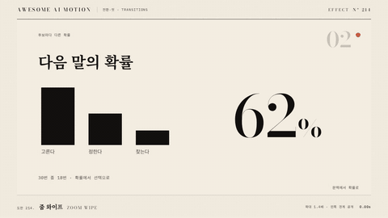

# Nº 214 줌 와이프 · Zoom Wipe



[MP4](clip.mp4) · [HTML](index.html)

**중심 확대가 진행되는 도중 직선 경계가 좌우로 이동해 새 장면을 공개하는 와이프**

Mid-zoom on the center, a straight edge moves across the frame and reveals the new scene.

| Family | Level | Purpose | Media | Runtime |
|---|---|---|---|---|
| 전환·컷 · TRANSITIONS | 기본 | 전환, 순서·흐름 | 설명 영상, 제품 시연, 숏폼 | gsap |

## 선택 기준 / Selection

카메라가 앞으로 밀고 들어가는 동안 페이지가 넘어간다는 감각 / The feeling of the camera pushing in while a page turns.

- 카메라 이동감이 있는 영상에서 장면을 바꿀 때 / Change scenes in videos with camera-move feel.
- 와이프에 깊이를 더하고 싶을 때 / Add depth to a wipe.

좋은 예 / Good: 앞 장면이 0.65초 동안 scale 1에서 1.4로 확대되는 사이 직선 경계가 왼쪽에서 오른쪽으로 이동하며 뒤 장면이 반대로 1.4에서 1로 줄며 나타난다
나쁜 예 / Bad: 확대와 경계 이동의 타이밍이 어긋나 두 동작이 따로 보이거나, scale이 2배를 넘어 픽셀이 깨진다
주의 / Avoid: 최대 scale 1.6 초과 금지 · 이징은 easeInOutCubic 계열로 둘 다 동일하게

## 파라미터 / Parameters

| Parameter | Default | Range | Note |
|---|---|---|---|
| 전체 지속 | 0.65s | 0.5~1.0s | 동시 |
| 앞 scale | 1→1.4 | 1.2~1.6 | 경계 쪽으로 확대 |
| 뒤 scale | 1.4→1 |  | 반대로 줄어듦 |
| 경계 방향 | 좌에서 우 | 4방향 | Left/Right 변형 |

이징 / Ease: `power3.inOut`

## 구현 / Implementation (GSAP)

```js
tl.to('.a', { scale: 1.4, duration: 0.65, ease: 'power3.inOut' }, 0)
  .fromTo('.b', { scale: 1.4, clipPath: 'inset(0 100% 0 0)' },
    { scale: 1, clipPath: 'inset(0 0% 0 0)', duration: 0.65, ease: 'power3.inOut' }, 0);
```

## 프롬프트 / Prompts

### 한국어 · Claude Code
```text
<대상A>에서 <대상B>로 줌 와이프를 만들어줘. A는 0.65초 동안 scale 1에서 1.4로 확대되고, B는 scale 1.4에서 1로 줄면서 clipPath inset이 (0 100% 0 0)에서 (0 0% 0 0)으로 열려 왼쪽에서 오른쪽으로 공개돼. 이징은 둘 다 power3.inOut, 같은 시각에 시작, paused 타임라인 하나.
```

### 한국어 · Codex
```text
<파일>에 zoom wipe를 적용해. .a scale 1에서 1.4 (0.65s power3.inOut), .b scale 1.4에서 1과 clipPath inset(0 100% 0 0)에서 inset(0 0% 0 0) (0.65s power3.inOut). 0.32초 캡처에서 경계가 화면 중앙 근처인지, 0.65초에 B가 scale 1로 전면인지 확인해.
```

### English · Claude Code
```text
Build a zoom wipe from <targetA> to <targetB>. A scales from 1 to 1.4 over 0.65 seconds while B scales from 1.4 to 1 and its clipPath inset opens from (0 100% 0 0) to (0 0% 0 0), revealing left to right. Both use power3.inOut, start together, and live in one paused timeline.
```

### English · Codex
```text
Apply a zoom wipe in <file>. .a scale 1 to 1.4 (0.65s power3.inOut); .b scale 1.4 to 1 and clipPath inset(0 100% 0 0) to inset(0 0% 0 0) (0.65s power3.inOut). Capture at 0.32 seconds to confirm the edge is near mid-frame, and at 0.65 seconds to confirm B is full frame at scale 1.
```

예시 / Example: 줌 와이프를 `.hero`에 적용해. / Apply Zoom Wipe to `.hero`.

## 적용 / Application

- HyperFrames: scale과 clipPath inset을 같은 이징으로 한 타임라인 position 0에 둔다. 확대 원점은 경계 반대편으로 고정한다
- ReelForge: 씬 워커 브리프에 peakScale, direction, durationMs를 싣는다
- Scrolline Deck: 진행률 p 하나로 scale과 inset을 함께 계산한다. 이징을 같은 곡선으로 두면 scrub에서도 일치한다

조합 / Pair with: [와이프 · Wipe](../wipe/) · [줌 전환 · Zoom Through](../zoom-through/) · [푸시 전환 · Push](../push-transition/)

출처 / Sources: [gl-transitions/gl-transitions](https://github.com/gl-transitions/gl-transitions/blob/master/transitions/ZoomLeftWipe.glsl) (MIT) · [gl-transitions/gl-transitions](https://github.com/gl-transitions/gl-transitions/blob/master/transitions/ZoomRigthWipe.glsl) (MIT) · [mifi/editly](https://github.com/mifi/editly#transition-types) (MIT)

[목록 / Catalog](../../references/catalog.md) · [index.json](../../index.json)
