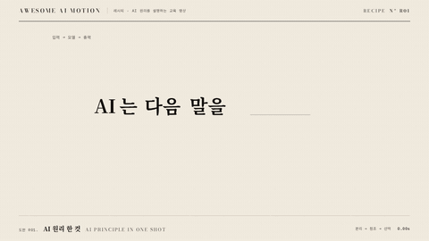

# R01 AI 원리 한 컷 · AI Principle in One Shot



**한 문장이 토큰 분리와 참조를 거쳐 다음 말 선택으로 완성된다**

- 어울리는 영상: AI 원리를 설명하는 교육 영상
- 구조: 토큰 쪼개기 → 어텐션 선 → 다음 말 고르기
- 길이: 6초

## 순서와 타이밍

| 시각 | 효과 | 역할 | 파라미터 |
|---|---|---|---|
| 0.3~1.63s | [토큰 쪼개기](../../effects/token-split/) | 입력 네 조각과 토큰 번호를 펼친다 | 4조각 · 추가 간격 34px · 1.05s · power3.inOut · 번호 시간차 0.06s |
| 1.55~3.06s | [어텐션 선](../../effects/attention-lines/) | 빈칸에서 앞 토큰을 참조하는 가중치를 보인다 | 선 0.5~6px · 진하기 0.25~0.9 · 1.15s · 시간차 0.12s · power2.inOut |
| 2.76~5.15s | [다음 말 고르기](../../effects/next-token/) | 확률을 보여 주고 고른다를 빈칸에 넣는다 | 후보 4개 · 62/21/9/5% · 기타 쓴다 3% · 막대 0.8s · 선택 4.12s · 이동 x530 y-275 · 0.7s · power3.inOut · 5.15~6s 홀드 |

## 주의

- 가중치와 확률은 교육용 예시다
- 참조 선과 후보 막대의 주 동작을 겹치지 않는다
- 완성 문장에 단어가 겹치지 않게 한다

## 에이전트 프롬프트

Claude Code

```text
6초 한 장면에 AI는 다음 말을 고른다의 생성 과정을 만든다. 0.3초부터 입력 네 조각을 34px 간격으로 1.05초 동안 분리하고 번호를 0.06초 간격으로 표시한다. 1.55초부터 참조 선을 0.5~6px 굵기, 1.15초 지속, 0.12초 시간차로 그린다. 3.06초부터 후보 확률 62/21/9/5%를 0.8초 동안 올리고 4.45초에 고른다를 x530 y-275로 0.7초 이동해 6초까지 홀드한다.
```

Codex

```text
recipes/ai-principle/index.html에 공용 무대와 paused GSAP 타임라인을 사용한다. token-split 0.3초, attention-lines 1.55초, next-token 막대 3.06초와 선택 이동 4.45초 순서로 구현한다. 1.5초, 2.5초, 3.47초, 5.8초 캡처에서 분리, 가중치 선, 후보 확률, 완성 문장을 확인한다. node scripts/render.mjs recipes/ai-principle --jobs 1과 python3 scripts/sheet.py recipes/ai-principle로 검증한다.
```
