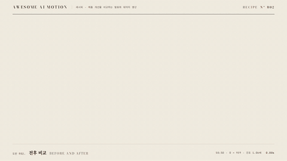

# R02 전후 비교 · Before and After



**전후를 나란히 펼치고 후 쪽 숫자와 차이 구절을 차례로 강조한다**

- 어울리는 영상: 제품 개선을 비교하는 발표와 데이터 영상
- 구조: 비교 분할 → 후 수치 카운트업 → 차이 단어 강조
- 길이: 5초

## 순서와 타이밍

| 시각 | 효과 | 역할 | 파라미터 |
|---|---|---|---|
| 0.3~0.95s | [비교 분할](../../effects/split-compare/) | 전후를 중앙 기준으로 나란히 공개한다 | 50:50 고정 · clip-path 바깥 방향 공개 · 0.65s · power2.inOut · 전 흐림 3px |
| 1.05~3.1s | [카운트업](../../effects/count-up/) | 후 쪽 수치를 올리고 강조색을 거둔다 | 0 → 939 · 1.65s · power2.out · 2.85~3.1s 주홍을 먹으로 |
| 3.1~3.75s | [단어 강조](../../effects/word-emphasis/) | 다음 말을 차이 구절로 강조한다 | 1.06배 · 주변 opacity 0.32 · 0.65s · power2.inOut · 3.75~5s 홀드 |

## 주의

- 비교 양쪽에 서로 다른 단위나 목표값을 쓰지 않는다
- 숫자와 단어에 주홍을 동시에 쓰지 않는다

## 에이전트 프롬프트

Claude Code

```text
5초 전후 비교를 50:50으로 만든다. 0.3초부터 0.65초 동안 양쪽 clip-path를 중앙에서 바깥으로 열고 전 쪽에 3px 흐림을 둔다. 1.05초부터 후 숫자를 power2.out으로 1.65초 동안 0에서 939까지 올린다. 2.85초에 숫자를 먹으로 돌린 뒤 3.1초부터 다음 말을 1.06배와 주홍으로 강조하고 주변을 0.32로 낮춰 5초까지 홀드한다.
```

Codex

```text
recipes/before-after/index.html의 GSAP 타임라인에 split-compare 0.3초, count-up 1.05초, word-emphasis 3.1초를 적용한다. 숫자는 프록시 객체와 onUpdate로 정수 표시한다. 1.23초, 2.1초, 3.73초, 4.83초에서 분할과 숫자 증가, 강조색 이동, 완성 홀드를 확인한다. node scripts/render.mjs recipes/before-after --jobs 1과 python3 scripts/sheet.py recipes/before-after로 검증한다.
```
