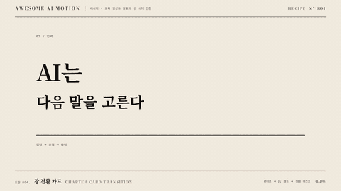

# R04 장 전환 카드 · Chapter Card Transition



**먹 바탕 장 번호 카드를 거쳐 다음 장의 첫 장면으로 넘어간다**

- 어울리는 영상: 교육 영상과 발표의 장 사이 전환
- 구조: 앞 장면 → 먹 바탕 02 와이프 → 장 제목 위계 등장 → 0.45초 홀드 → 원형 마스크로 다음 장
- 길이: 4초

## 순서와 타이밍

| 시각 | 효과 | 역할 | 파라미터 |
|---|---|---|---|
| 0.30~1.20s | [와이프](../../effects/wipe/) | 앞 장면을 먹 바탕 장 번호 카드로 교체한다 | inset 오른쪽 100% → 0%, duration 0.90s / none, 경계 4px / x 0 → 1164px |
| 0.90~1.60s | [모션 위계](../../effects/motion-hierarchy/) | Bodoni 02를 먼저 읽고 장 제목과 부제를 따른다 | 02 290px / y 32px / 0.70s, 제목 y 18px / 0.40s, 부제 opacity 1 / 1.60s, power3.out, 와이프 오버랩 0.30s, 카드 홀드 1.60~2.05s |
| 2.05~3.40s | [마스크 전환](../../effects/iris-mask/) | 장 카드 중심에서 다음 장의 첫 장면을 공개한다 | circle 반경 0 → 680px, 중심 584px 290px, duration 1.35s / power2.inOut, 다음 장 완성 홀드 0.60s |

## 주의

- 완료 반경을 모서리 거리보다 작게 두지 않는다
- 장 제목을 읽는 홀드를 생략하지 않는다
- 먹 바탕에서는 글자에 종이색 토큰을 사용한다

## 에이전트 프롬프트

Claude Code

```text
4초 장 전환 카드을 GSAP 코어와 공용 종이·먹·주홍 무대로 만들며, 0.30~1.20s에 wipe 효과로 앞 장면을 먹 바탕 장 번호 카드로 교체한다 값은 inset 오른쪽 100% → 0%, duration 0.90s / none, 경계 4px / x 0 → 1164px이다. 0.90~1.60s에 motion-hierarchy 효과로 Bodoni 02를 먼저 읽고 장 제목과 부제를 따른다 값은 02 290px / y 32px / 0.70s, 제목 y 18px / 0.40s, 부제 opacity 1 / 1.60s, power3.out, 와이프 오버랩 0.30s, 카드 홀드 1.60~2.05s이다. 2.05~3.40s에 iris-mask 효과로 장 카드 중심에서 다음 장의 첫 장면을 공개한다 값은 circle 반경 0 → 680px, 중심 584px 290px, duration 1.35s / power2.inOut, 다음 장 완성 홀드 0.60s이다. 단일 paused 타임라인으로 seek를 지원하고 마지막 0.6초 이상 완성 상태를 유지한다.
```

Codex

```text
recipes/chapter-transition/index.html에 4초 레시피를 구현한다. 0.30~1.20s에 wipe 효과로 앞 장면을 먹 바탕 장 번호 카드로 교체한다 값은 inset 오른쪽 100% → 0%, duration 0.90s / none, 경계 4px / x 0 → 1164px이다. 0.90~1.60s에 motion-hierarchy 효과로 Bodoni 02를 먼저 읽고 장 제목과 부제를 따른다 값은 02 290px / y 32px / 0.70s, 제목 y 18px / 0.40s, 부제 opacity 1 / 1.60s, power3.out, 와이프 오버랩 0.30s, 카드 홀드 1.60~2.05s이다. 2.05~3.40s에 iris-mask 효과로 장 카드 중심에서 다음 장의 첫 장면을 공개한다 값은 circle 반경 0 → 680px, 중심 584px 290px, duration 1.35s / power2.inOut, 다음 장 완성 홀드 0.60s이다. node scripts/render.mjs recipes/chapter-transition --jobs 1로 렌더하고 python3 scripts/sheet.py recipes/chapter-transition로 접촉 인화를 만든다. 0.2초 앞 장면, 0.9초 와이프, 1.8초 먹 바탕 02 카드, 2.7초 원형 마스크, 3.9초 다음 장의 모서리와 완성 홀드를 확인한다 잘림과 주홍 초점 중복을 점검한 뒤 .staging/recipes/chapter-transition.json을 작성한다.
```
