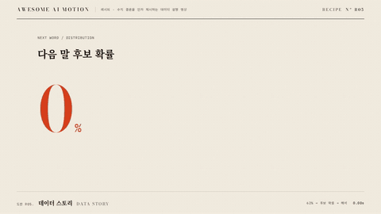

# R05 데이터 스토리 · Data Story



**결론 숫자에서 후보별 확률 근거와 해석으로 이어진다**

- 어울리는 영상: 수치 결론을 먼저 제시하는 데이터 설명 영상
- 구조: 62% 카운트업 → 후보 확률 막대 성장 → 최고 확률 해석 주석
- 길이: 6초

## 순서와 타이밍

| 시각 | 효과 | 역할 | 파라미터 |
|---|---|---|---|
| 0.30~2.32s | [카운트업](../../effects/count-up/) | 고른다의 후보 확률 62%를 결론으로 제시한다 | 프록시 0 → 62, 정수 반올림, duration 1.65s, power2.out, 단위 2.02s / 0.30s |
| 2.10~4.02s | [막대 성장](../../effects/bar-grow/) | 같은 척도로 다섯 후보의 확률을 비교한다 | 62·21·9·5·3%, 7px/%, scaleX 0 → 1, duration 1.05s, stagger 0.08s, power2.out, 큰 숫자는 먹색으로 전환 |
| 3.85~5.02s | [주석 등장](../../effects/annotation-callout/) | 고른다가 다섯 후보 중 가장 높은 확률임을 해석한다 | 지시선 pathLength 1 / 0.65s / none, 텍스트 y 8px / 0.35s, stagger 0.12s, 최종 홀드 0.98s |

## 주의

- 큰 숫자와 막대가 서로 다른 지표를 가리키지 않게 한다
- 후보 확률을 실제 선택 빈도라고 해석하지 않는다
- 주홍은 큰 숫자에서 첫 막대로 옮긴다

## 에이전트 프롬프트

Claude Code

```text
6초 데이터 스토리을 GSAP 코어와 공용 종이·먹·주홍 무대로 만들며, 0.30~2.32s에 count-up 효과로 고른다의 후보 확률 62%를 결론으로 제시한다 값은 프록시 0 → 62, 정수 반올림, duration 1.65s, power2.out, 단위 2.02s / 0.30s이다. 2.10~4.02s에 bar-grow 효과로 같은 척도로 다섯 후보의 확률을 비교한다 값은 62·21·9·5·3%, 7px/%, scaleX 0 → 1, duration 1.05s, stagger 0.08s, power2.out, 큰 숫자는 먹색으로 전환이다. 3.85~5.02s에 annotation-callout 효과로 고른다가 다섯 후보 중 가장 높은 확률임을 해석한다 값은 지시선 pathLength 1 / 0.65s / none, 텍스트 y 8px / 0.35s, stagger 0.12s, 최종 홀드 0.98s이다. 단일 paused 타임라인으로 seek를 지원하고 마지막 0.6초 이상 완성 상태를 유지한다.
```

Codex

```text
recipes/data-story/index.html에 6초 레시피를 구현한다. 0.30~2.32s에 count-up 효과로 고른다의 후보 확률 62%를 결론으로 제시한다 값은 프록시 0 → 62, 정수 반올림, duration 1.65s, power2.out, 단위 2.02s / 0.30s이다. 2.10~4.02s에 bar-grow 효과로 같은 척도로 다섯 후보의 확률을 비교한다 값은 62·21·9·5·3%, 7px/%, scaleX 0 → 1, duration 1.05s, stagger 0.08s, power2.out, 큰 숫자는 먹색으로 전환이다. 3.85~5.02s에 annotation-callout 효과로 고른다가 다섯 후보 중 가장 높은 확률임을 해석한다 값은 지시선 pathLength 1 / 0.65s / none, 텍스트 y 8px / 0.35s, stagger 0.12s, 최종 홀드 0.98s이다. node scripts/render.mjs recipes/data-story --jobs 1로 렌더하고 python3 scripts/sheet.py recipes/data-story로 접촉 인화를 만든다. 0.5초 숫자 증가, 2.5초 막대 성장, 4초 지시선, 5.9초 해석 홀드를 확인한다 잘림과 주홍 초점 중복을 점검한 뒤 .staging/recipes/data-story.json을 작성한다.
```
