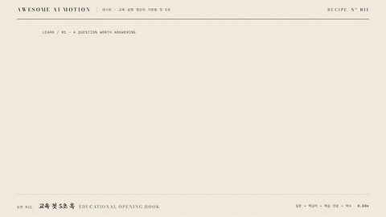

# R11 교육 첫 5초 훅 · Educational Opening Hook



[MP4](clip.mp4) · [HTML](index.html)

**질문으로 호기심을 열고 핵심어, 학습 경로, 이해할 개념을 5초 안에 보여 준다**

Open with a question, then reveal the key phrase, learning path, and concept to understand within five seconds.

- 영상 / Video: 교육·설명 영상의 가로형 첫 5초 / The first five seconds of a landscape educational or explainer video
- 구조 / Structure: 질문 공개 → 핵심어 강조 → 학습 경로 → 학습 목표 밑줄 / Reveal a question → emphasize its key phrase → show the learning path → underline the learning goal
- 길이·화면 / Duration & canvas: 5초 / 5s · 1280x720 (16:9)

## 순서와 타이밍 / Sequence & timing

| 시각 / Time | 효과 / Effect | 역할 / Role | 파라미터 / Parameters |
|---|---|---|---|
| 0.12~1.04s | [마스크 리빌 · Mask Reveal](../../effects/mask-reveal/) | AI는 왜 다음 말을 고를까? 질문 두 줄 공개 / Reveal the two-line question | y 110% → 0 · 0.7s · stagger 0.22s · power3.out |
| 1.25~2.15s | [단어 강조 · Word Emphasis](../../effects/word-emphasis/) | 다음 말에 시선을 모은 뒤 강조색 해제 / Focus on next word, then release the accent | scale 1.04 · 0.5s · power2.inOut · reset 1.85~2.15s |
| 2.15~3.0s | [스태거 · Stagger](../../effects/stagger/) | 입력, 후보 확률, 선택의 학습 경로 제시 / Reveal input, probabilities, selection | y 16px → 0 · opacity 0 → 1 · 0.45s · stagger 0.2s |
| 3.3~5s | [밑줄 드로우 · Underline Draw](../../effects/underline-draw/) | 예측의 원리 학습 목표를 밑줄로 고정 / Underline the prediction learning goal | goal fade 3.05~3.25s · dashoffset 1 → 0 · 0.7s · ease none · hold 4~5s |

## 소재 바꾸기 / Adapt the lesson

질문, 세 단계 경로, 학습 목표를 본편 주제로 교체하고 타이밍과 16:9 구도를 유지한다.
Replace the question, three-step path, and learning goal with your lesson topic while keeping the timing and 16:9 layout.

예시 / Example: “분수는 왜 나눌까?” → “전체 → 같은 크기 조각 → 분수” → “부분과 전체의 관계” / “Why do fractions divide?” → “Whole → Equal parts → Fraction” → “How parts relate to a whole”.

## 주의 / Cautions

- 질문과 학습 목표는 본편에서 실제로 답할 내용으로 쓴다 / Use a question and learning goal that the main lesson actually answers.
- 문장은 두 줄 이내, 학습 경로는 세 단계 이내로 제한한다 / Keep the question to two lines and the learning path to three steps.
- 동시에 두 개의 핵심어를 강조하지 않고 4~5초에는 읽는 시간을 둔다 / Emphasize only one phrase at a time and hold the final layout from 4s to 5s.

## 에이전트 프롬프트 / Agent prompts

### 한국어 · Claude Code
```text
16:9 교육·설명 영상의 첫 5초 훅을 만든다. 질문은 AI는 왜 다음 말을 고를까?, 목표는 예측의 원리, 경로는 입력 → 후보 확률 → 선택이다. 0.12초 질문 두 줄을 0.7초, 시간차 0.22초로 공개한다. 1.25초 다음 말을 1.04배와 주홍으로 0.5초 강조하고 1.85~2.15초에 원상복구한다. 2.15초부터 경로 세 단계를 0.45초, 시간차 0.2초로 올린다. 3.05초 목표를 보이고 3.3~4초 밑줄을 그린 뒤 5초까지 유지한다. 질문과 목표는 본편 주제로 바꿔 쓴다.
```

### 한국어 · Codex
```text
recipes/edu-hook/index.html의 공용 무대와 paused GSAP 타임라인으로 1280x720, 5초 레시피를 구현한다. mask-reveal 0.12초, word-emphasis 1.25초, stagger 2.15초, underline-draw 3.3초 순서다. 질문, 학습 경로, 목표는 국문과 영문을 함께 표시한다. 임의 시간 seek가 가능해야 하며 0.5초, 1.7초, 2.8초, 4.7초에서 질문 공개, 강조, 경로, 마지막 홀드를 확인한다. node scripts/render.mjs recipes/edu-hook --jobs 1로 렌더한다.
```

### English · Claude Code
```text
Create a 16:9 five-second educational opening hook. Ask Why does AI predict the next word?, promise an understanding of prediction, and show Input → Probabilities → Selection. Reveal two question lines at 0.12s with a 0.7s duration and 0.22s stagger. Emphasize next word at 1.25s with scale 1.04 and vermilion for 0.5s, then reset from 1.85s to 2.15s. Reveal the three learning steps at 2.15s with a 0.45s duration and 0.2s stagger. Show the goal at 3.05s, draw its underline from 3.3s to 4s, and hold until 5s. Replace the question and goal with the actual lesson topic.
```

### English · Codex
```text
Implement a 1280x720 five-second recipe in recipes/edu-hook/index.html using the shared stage and one paused GSAP timeline. Apply mask-reveal at 0.12s, word-emphasis at 1.25s, stagger at 2.15s, and underline-draw at 3.3s. Display the question, learning path, and goal in Korean and English. Support arbitrary seeking. Check the question reveal at 0.5s, emphasis at 1.7s, learning path at 2.8s, and final hold at 4.7s. Render with node scripts/render.mjs recipes/edu-hook --jobs 1.
```

## 렌더 / Render

```sh
node scripts/render.mjs recipes/edu-hook --jobs 1
```

[레시피 목록 / Recipes](../../site/recipes.html) · [index.json](../../index.json)
