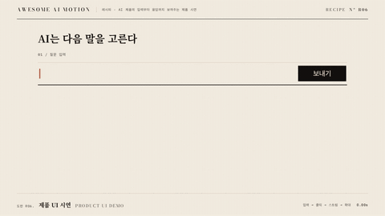

# R06 제품 UI 시연 · Product UI Demo



**질문 입력과 모델 응답을 실제 UI 동작 순서로 보여준다**

- 어울리는 영상: AI 제품의 입력부터 응답까지 보여주는 제품 시연
- 구조: 질문 타이핑 → 커서 클릭 → 답 스트리밍 → 응답 핵심 확대
- 길이: 6초

## 순서와 타이밍

| 시각 | 효과 | 역할 | 파라미터 |
|---|---|---|---|
| 0.38~1.91s | [타이핑 입력](../../effects/typing-input/) | 입력창에 질문을 한 글자씩 입력한다 | 글자 간격 고정 배열 0.07~0.17s, 캐럿 반주기 0.24s, 입력 완료 1.91s |
| 1.61~3.14s | [커서 이동과 클릭](../../effects/cursor-click/) | 입력을 마친 질문을 보내기 버튼으로 전송한다 | 곡선 이동 810px / y -181px / 높이 150px / 1.10s / power2.inOut, 클릭 2.71s, scale 0.94 / 0.12s, 파문 2.4배 / 0.40s |
| 2.83~4.71s | [답 스트리밍](../../effects/answer-stream/) | 10개 묶음으로 모델 응답을 차례로 출력한다 | 묶음 간격 0.18s, 초기 opacity 0.22, 정착 0.26s / none, 입력과 클릭 오버랩 0.30s |
| 4.41~5.35s | [확대 콜아웃](../../effects/zoom-callout/) | 응답 핵심인 확률 계산을 옆 원형 콜아웃으로 확대한다 | 글자 29px → 104px / 3.59배, 원 지름 330px, x -120px → 0 / scale 0.25 → 1 / 0.85s / power3.out, 연결선 0.65s, 스트림 오버랩 0.30s, 최종 홀드 0.65s |

## 주의

- 입력 완료 전에 클릭하지 않는다
- 콜아웃은 원 응답과 같은 문구를 사용한다
- 입력 캐럿과 확대 콜아웃의 주홍을 동시에 켜지 않는다

## 에이전트 프롬프트

Claude Code

```text
6초 제품 UI 시연을 GSAP 코어와 공용 종이·먹·주홍 무대로 만들며, 0.38~1.91s에 typing-input 효과로 입력창에 질문을 한 글자씩 입력한다 값은 글자 간격 고정 배열 0.07~0.17s, 캐럿 반주기 0.24s, 입력 완료 1.91s이다. 1.61~3.14s에 cursor-click 효과로 입력을 마친 질문을 보내기 버튼으로 전송한다 값은 곡선 이동 810px / y -181px / 높이 150px / 1.10s / power2.inOut, 클릭 2.71s, scale 0.94 / 0.12s, 파문 2.4배 / 0.40s이다. 2.83~4.71s에 answer-stream 효과로 10개 묶음으로 모델 응답을 차례로 출력한다 값은 묶음 간격 0.18s, 초기 opacity 0.22, 정착 0.26s / none, 입력과 클릭 오버랩 0.30s이다. 4.41~5.35s에 zoom-callout 효과로 응답 핵심인 확률 계산을 옆 원형 콜아웃으로 확대한다 값은 글자 29px → 104px / 3.59배, 원 지름 330px, x -120px → 0 / scale 0.25 → 1 / 0.85s / power3.out, 연결선 0.65s, 스트림 오버랩 0.30s, 최종 홀드 0.65s이다. 단일 paused 타임라인으로 seek를 지원하고 마지막 0.6초 이상 완성 상태를 유지한다.
```

Codex

```text
recipes/product-demo/index.html에 6초 레시피를 구현한다. 0.38~1.91s에 typing-input 효과로 입력창에 질문을 한 글자씩 입력한다 값은 글자 간격 고정 배열 0.07~0.17s, 캐럿 반주기 0.24s, 입력 완료 1.91s이다. 1.61~3.14s에 cursor-click 효과로 입력을 마친 질문을 보내기 버튼으로 전송한다 값은 곡선 이동 810px / y -181px / 높이 150px / 1.10s / power2.inOut, 클릭 2.71s, scale 0.94 / 0.12s, 파문 2.4배 / 0.40s이다. 2.83~4.71s에 answer-stream 효과로 10개 묶음으로 모델 응답을 차례로 출력한다 값은 묶음 간격 0.18s, 초기 opacity 0.22, 정착 0.26s / none, 입력과 클릭 오버랩 0.30s이다. 4.41~5.35s에 zoom-callout 효과로 응답 핵심인 확률 계산을 옆 원형 콜아웃으로 확대한다 값은 글자 29px → 104px / 3.59배, 원 지름 330px, x -120px → 0 / scale 0.25 → 1 / 0.85s / power3.out, 연결선 0.65s, 스트림 오버랩 0.30s, 최종 홀드 0.65s이다. node scripts/render.mjs recipes/product-demo --jobs 1로 렌더하고 python3 scripts/sheet.py recipes/product-demo로 접촉 인화를 만든다. 1.5초 타이핑, 2.7초 버튼 도착, 3.5초 응답 묶음, 5.8초 확대 결과와 완성 홀드를 확인한다 잘림과 주홍 초점 중복을 점검한 뒤 .staging/recipes/product-demo.json을 작성한다.
```
