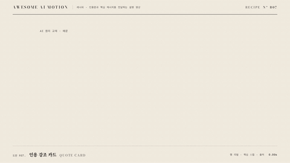

# R07 인용 강조 카드 · Quote Card



**두 줄 인용문을 공개하고 핵심 구절과 출처를 차례로 보인다**

- 어울리는 영상: 인용문과 핵심 메시지를 전달하는 설명 영상
- 구조: 행 단위 마스크 리빌 → 핵심 구절 하이라이트 → 출처 지시선
- 길이: 4초

## 순서와 타이밍

| 시각 | 효과 | 역할 | 파라미터 |
|---|---|---|---|
| 0.3~1.7s | [마스크 리빌](../../effects/mask-reveal/) | 큰 따옴표 없이 인용문 두 줄을 읽게 한다 | yPercent 110 → 0 · 1.05s · 행 시간차 0.35s · power3.out |
| 1.4~2.75s | [하이라이트 스윕](../../effects/highlight-sweep/) | 다음 말 구절만 왼쪽부터 칠한다 | scaleX 0 → 1 · 1.35s · power1.inOut · 높이 66px · 좌우 8px · 앞 단계 겹침 0.3s |
| 2.4~3.4s | [주석 등장](../../effects/annotation-callout/) | 먹 점과 지시선 뒤에 출처 한 줄을 보인다 | 점 반지름 4px · 지시선 0.65s · none · 출처 3.05s 시작 · y8 → 0 · 0.35s · 3.4~4s 홀드 |

## 주의

- 장식용 큰 따옴표와 상자 패널을 만들지 않는다
- 교재 예문을 실제 인물의 발언으로 표기하지 않는다
- 출처는 두 줄 인용문을 읽은 뒤 공개한다

## 에이전트 프롬프트

Claude Code

```text
4초 인용 강조 장면을 종이와 먹 스타일로 만들고 큰 따옴표를 넣지 않는다. AI는 앞의 말을 읽고, 다음 말을 고른다를 두 줄로 나누고 0.3초부터 yPercent110에서 1.05초와 행 간격0.35초로 공개한다. 1.4초부터 다음 말 아래의 높이66px 띠를 scaleX0에서1로 1.35초 동안 칠한다. 2.4초부터 출처 지시선을 0.65초 그린 뒤 3.05초에 출처 · AI 원리 교재 예문을 y8에서0으로 0.35초 등장시키고 4초까지 홀드한다.
```

Codex

```text
recipes/quote-card/index.html에 mask-reveal 0.3초, highlight-sweep 1.4초, annotation-callout 2.4초 순서의 paused GSAP 타임라인을 만든다. 지시선은 SVG pathLength1과 strokeDashoffset1에서0으로 구현하며 출처는 선 완성 뒤 3.05초에 표시한다. 1초, 1.67초, 2.3초, 3초, 3.87초 캡처에서 행 리빌, 한 구절 강조, 지시선, 출처와 최종 홀드를 확인한다. node scripts/render.mjs recipes/quote-card --jobs 1과 python3 scripts/sheet.py recipes/quote-card로 검증한다.
```
