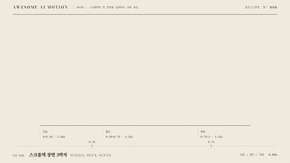

# R08 스크롤덱 장면 3박자 · Scroll Deck Scene



**진입과 홀드와 퇴장을 진행률 세 구간으로 보여 준다**

- 어울리는 영상: 스크롤덱의 한 장면을 설계하는 교육 영상
- 구조: 스태거와 마스크 진입 → 홀드 중 하이라이트 → 묶음 페이드와 위로 퇴장
- 길이: 5초

## 순서와 타이밍

| 시각 | 효과 | 역할 | 파라미터 |
|---|---|---|---|
| 0.15~0.56s | [스태거](../../effects/stagger/) | 보조 라벨을 순서대로 올린다 | y24 → 0 · opacity 0 → 1 · 0.35s · 시간차 0.06s · power3.out |
| 0.3~1.5s | [마스크 리빌](../../effects/mask-reveal/) | 두 제목 줄을 행 마스크로 공개한다 | yPercent 110 → 0 · 1.05s · 행 시간차 0.15s · power3.out · 앞 단계 겹침 0.26s |
| 1.75~3.1s | [하이라이트 스윕](../../effects/highlight-sweep/) | 홀드 중 핵심 구절을 왼쪽부터 칠한다 | scaleX 0 → 1 · 1.35s · power1.inOut · 높이 66px · 좌우 8px |
| 3.75~4.4s | [크로스페이드](../../effects/crossfade/) | 묶음을 위로 지우고 구간 요약으로 연결한다 | 그룹 y-24 · opacity 1 → 0 · 0.65s · none · 요약 4.1~4.4s · 겹침 0.3s · 4.4~5s 홀드 |

## 주의

- 진입 동작은 진행률 0.30 전에 끝낸다
- 홀드 중 제목 위치를 움직이지 않는다
- 퇴장 뒤 요약과 구간 눈금은 남긴다

## 에이전트 프롬프트

Claude Code

```text
5초 스크롤덱 장면을 진입 0~1.5초, 홀드 1.5~3.75초, 퇴장 3.75~5초로 나눈다. 진입 라벨은 y24와 0.06초 스태거와 0.35초 지속으로 올리고 제목 두 줄은 0.3초부터 yPercent110에서 1.05초와 행 간격 0.15초로 마스크 리빌한다. 1.75초부터 다음 말의 높이66px 띠를 1.35초 동안 왼쪽부터 칠한다. 3.75초부터 제목 묶음을 y-24와 opacity0으로 0.65초 퇴장시키고 4.1초부터 구간 요약을 0.3초 공개해 마지막 0.6초 홀드한다. 캡션 진행 바의 30%와 75%에 0.30과 0.75 눈금을 둔다.
```

Codex

```text
recipes/scrolldeck-scene/index.html에 5초 타임라인과 캡션 눈금 left30%, left75%를 만든다. stagger 0.15초, mask-reveal 0.3초, highlight-sweep 1.75초, crossfade 퇴장 3.75초 순서로 배치한다. 0.4초, 1.5초, 2.9초, 4.1초, 4.83초에서 진입 마스크, 완전 홀드, 스윕, 위로 퇴장, 요약 정지를 확인한다. node scripts/render.mjs recipes/scrolldeck-scene --jobs 1과 python3 scripts/sheet.py recipes/scrolldeck-scene로 검증한다.
```
