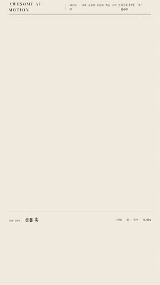

# R09 숏폼 훅 · Shorts Hook



**첫 1초의 세 단어 훅을 줌으로 넘기고 숫자와 결론으로 끝낸다**

- 어울리는 영상: 세로 숏폼의 도입과 핵심 수치 전달
- 구조: 키네틱 세 비트 → O 안으로 줌 전환 → 939 카운트업과 결론
- 길이: 5초

## 순서와 타이밍

| 시각 | 효과 | 역할 | 파라미터 |
|---|---|---|---|
| 0.08~0.98s | [키네틱 비트](../../effects/kinetic-beats/) | 첫 1초에 읽고 매기고 고른다를 교체한다 | 비트 간격 0.3s · 사용자 첫 1초 조건에 맞춤 · scale 1.4 → 1 · 정착 0.2s · power3.out |
| 0.98~2.45s | [줌 전환](../../effects/zoom-through/) | O 구멍을 확대하며 숫자 장면을 보여 준다 | 포털 scale 1 → 8 · 1.35s · power3.in · 다음 장면 scale 0.18 → 1 · 1.15s · power2.out |
| 2.25~4.35s | [카운트업](../../effects/count-up/) | 큰 수치와 한 줄 결론을 순서대로 완성한다 | 0 → 939 · 1.65s · power2.out · 결론 4.05~4.35s · y12 → 0 · 4.35~5s 홀드 |

## 주의

- body data-size를 720x1280으로 유지한다
- 화면 y1024~1280 아래 20%에는 캡션도 두지 않는다
- 세 단어를 동시에 띄우지 않는다

## 에이전트 프롬프트

Claude Code

```text
720x1280 세로 5초 훅을 만들고 화면 아래 256px를 비운다. 0.08초와 0.38초와 0.68초에 읽고 매기고 고른다를 scale1.4에서 1로 0.2초 정착시킨다. 1초부터 O 포털을 8배로 1.35초 확대하며 다음 장면은 0.18배에서 1배로 1.15초 동안 접근시킨다. 2.25초부터 939를 1.65초 동안 카운트업하고 4.05초부터 한 줄 결론을 0.3초 공개해 5초까지 홀드한다. 캡션은 bottom256px로 옮기고 장면 bottom332px로 제한한다.
```

Codex

```text
recipes/shorts-hook/index.html의 body에 data-size="720x1280"을 넣고 공용 무대를 사용한다. kinetic-beats 세 단어를 0.08/0.38/0.68초, zoom-through를 1초, count-up을 2.25초에 시작한다. 0.17초, 0.47초, 0.77초, 1.9초, 3.2초, 4.83초 캡처에서 비트와 줌, 숫자, 결론을 확인한다. node scripts/render.mjs recipes/shorts-hook --jobs 1과 python3 scripts/sheet.py recipes/shorts-hook 실행 뒤 원래 세로 비율의 접촉 인화도 확인하고 아래 256px가 비었는지 검사한다.
```
