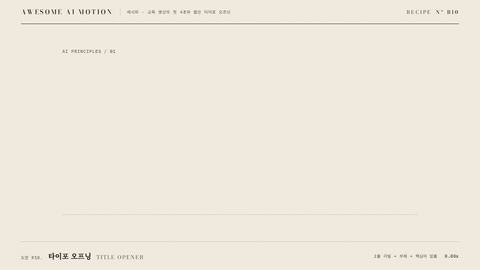

# R10 타이포 오프닝 · Title Opener



**두 줄 제목과 부제의 리듬으로 시작하고 핵심어를 밑줄로 짚는다**

- 어울리는 영상: 교육 영상의 첫 4초와 짧은 타이포 오프닝
- 구조: 두 줄 제목 마스크 리빌 → 부제 글자별 스태거 → 다음 말 밑줄 드로우
- 길이: 4초

## 순서와 타이밍

| 시각 | 효과 | 역할 | 파라미터 |
|---|---|---|---|
| 0.30~1.70s | [마스크 리빌](../../effects/mask-reveal/) | 두 줄 제목을 아래에서 위로 공개한다 | yPercent 110 → 0, 줄 지속 1.05s, 줄 간격 0.35s, power3.out, overflow hidden |
| 1.40~2.30s | [글자별 스태거](../../effects/char-stagger/) | 부제를 글자 단위로 등장시킨다 | 입력에서 출력까지 9글자 공백 포함, y 64px → 0, opacity 0 → 1, 글자 지속 0.62s, stagger 0.035s, power3.out, 제목과 오버랩 0.30s |
| 2.00~3.35s | [밑줄 드로우](../../effects/underline-draw/) | 핵심어 다음 말 아래에 주홍 한 획을 긋는다 | pathLength 1, stroke 6px, strokeDashoffset 1 → 0, autoRound false, duration 1.35s, none, 부제와 오버랩 0.30s, 최종 홀드 0.65s |

## 주의

- 밑줄을 글자 획에 겹치지 않는다
- 부제는 짧은 한 줄로 유지한다
- 줄 마스크의 높이를 제목 행간보다 작게 두지 않는다

## 에이전트 프롬프트

Claude Code

```text
4초 타이포 오프닝을 GSAP 코어와 공용 종이·먹·주홍 무대로 만들며, 0.30~1.70s에 mask-reveal 효과로 두 줄 제목을 아래에서 위로 공개한다 값은 yPercent 110 → 0, 줄 지속 1.05s, 줄 간격 0.35s, power3.out, overflow hidden이다. 1.40~2.30s에 char-stagger 효과로 부제를 글자 단위로 등장시킨다 값은 입력에서 출력까지 9글자 공백 포함, y 64px → 0, opacity 0 → 1, 글자 지속 0.62s, stagger 0.035s, power3.out, 제목과 오버랩 0.30s이다. 2.00~3.35s에 underline-draw 효과로 핵심어 다음 말 아래에 주홍 한 획을 긋는다 값은 pathLength 1, stroke 6px, strokeDashoffset 1 → 0, autoRound false, duration 1.35s, none, 부제와 오버랩 0.30s, 최종 홀드 0.65s이다. 단일 paused 타임라인으로 seek를 지원하고 마지막 0.6초 이상 완성 상태를 유지한다.
```

Codex

```text
recipes/title-opener/index.html에 4초 레시피를 구현한다. 0.30~1.70s에 mask-reveal 효과로 두 줄 제목을 아래에서 위로 공개한다 값은 yPercent 110 → 0, 줄 지속 1.05s, 줄 간격 0.35s, power3.out, overflow hidden이다. 1.40~2.30s에 char-stagger 효과로 부제를 글자 단위로 등장시킨다 값은 입력에서 출력까지 9글자 공백 포함, y 64px → 0, opacity 0 → 1, 글자 지속 0.62s, stagger 0.035s, power3.out, 제목과 오버랩 0.30s이다. 2.00~3.35s에 underline-draw 효과로 핵심어 다음 말 아래에 주홍 한 획을 긋는다 값은 pathLength 1, stroke 6px, strokeDashoffset 1 → 0, autoRound false, duration 1.35s, none, 부제와 오버랩 0.30s, 최종 홀드 0.65s이다. node scripts/render.mjs recipes/title-opener --jobs 1로 렌더하고 python3 scripts/sheet.py recipes/title-opener로 접촉 인화를 만든다. 0.5초 첫 줄, 1초 두 번째 줄, 1.8초 부제 상승, 2.8초 부분 밑줄, 3.9초 완성 홀드를 확인한다 잘림과 주홍 초점 중복을 점검한 뒤 .staging/recipes/title-opener.json을 작성한다.
```
